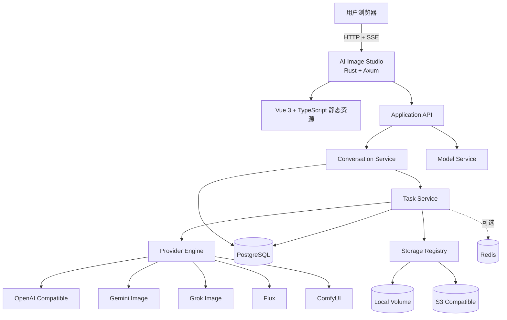
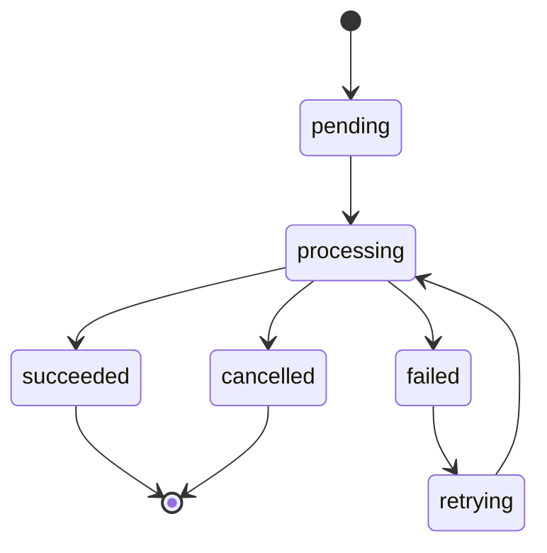
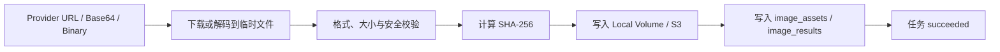
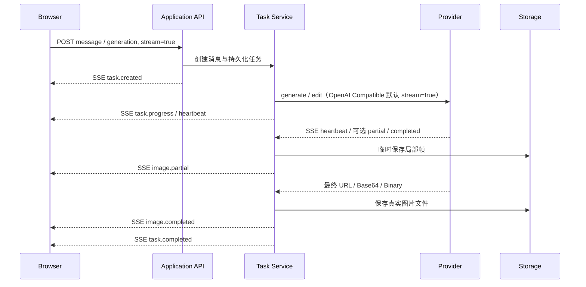
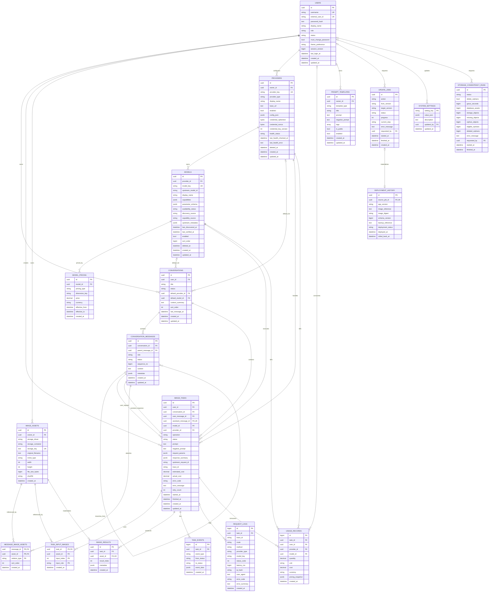
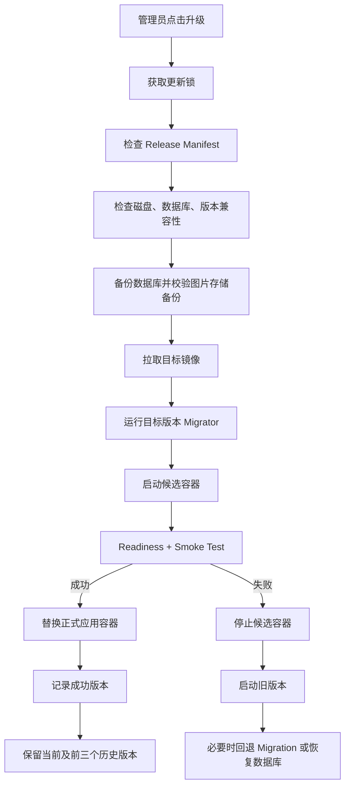

# AI Image Studio 工程方案设计文档 V4.2

## 0. 当前实现状态

截至 2026-07-22，仓库代码已落地本文主链能力：OpenAI Compatible、Gemini Image 与 Grok Image Adapter，动态模型发现和参数 Schema，多轮会话、图片编辑、默认 SSE、Local/S3 真实文件持久化、用户/管理员权限、Prompt 模板、Redis 可选队列与独立 Worker、自动重试、用量/成本统计、管理员运营日志，以及委托独立 Host Updater 的升级/回滚管理面。

`TASK_EXECUTION_MODE=inline` 时由 API 进程内执行任务；`TASK_EXECUTION_MODE=redis` 时 API 只创建持久化任务并写入 Redis，独立 `worker` 消费队列，同时定时从 PostgreSQL 兜底领取遗漏任务。PostgreSQL 始终是任务与状态的事实来源，Redis 只承担派发与唤醒，不保存唯一业务状态。

在线升级仍遵守本文安全边界：仓库已包含管理员页面、Manifest 兼容性检查、二次输密、操作审计，以及独立 `ai-image-studio-host-updater` 宿主机服务。Web 通过专用 Unix Socket 或回环地址提交带时间戳 HMAC 的请求；固定执行器负责备份、镜像 Digest/Cosign 验证、迁移、候选健康检查、切换和失败恢复。Web 容器只挂载专用 Updater Socket，不挂载 Docker Socket。隔离环境已跑通真实签名镜像成功链、五类故障恢复，以及 Web → Unix Socket → Host Updater → 正式执行器 → 部署历史回写整链；生产启用前仍需使用生产数据副本、真实发布 Registry 补进程中断和不同版本回滚验收。

> 一个基于 **Vue 3 + TypeScript + Vite + Naive UI + Rust + Axum** 的自托管、多供应商 AI 图片生成平台。

- 仓库名：`ai-image-studio`
- 文档版本：V4.2
- 前端：Vue 3 + **TypeScript** + Vite + Naive UI
- 后端：Rust + Axum + Tokio
- 数据库：PostgreSQL + SQLx
- 部署：Docker Compose
- 首版 Provider：OpenAI Compatible、Google Gemini Image、xAI Grok Image
- 后续 Provider：Flux、ComfyUI、Replicate、fal.ai、自定义 Provider

---

## 1. 项目定位

AI Image Studio 是一个独立部署的多供应商 AI 图片生成平台，提供统一的 Web UI、统一任务模型、统一存储、统一日志与统一 Provider 扩展接口。

项目通过 OpenAI Compatible Images API 对接 OpenAI 或任意兼容服务，核心代码不依赖特定中转产品的私有实现，也不假设 AI Image Studio 与上游部署在同一台服务器。

### 1.1 核心目标

1. 支持文生图、图生图、图片编辑和历史记录。
2. 支持在同一会话中连续多轮问答和生图，例如基于上一轮结果继续要求“改成夜景”或“保持人物，换一个背景”。
3. 浏览器侧生图默认使用 SSE 流式事件，实时反馈排队、生成、文件持久化和完成状态；断线后可以恢复事件或轮询任务。
4. 支持用户使用自己的上游 API Key。
5. 支持 OpenAI Compatible、Gemini、Grok 等不同协议。
6. 图片真实文件支持 Local 与 S3 Compatible 两种存储驱动，并可通过配置切换。
7. 支持 Docker Compose 一键部署。
8. 支持 PostgreSQL 持久化会话、消息、任务、结果、日志和统计。
9. 支持用户名密码登录、管理员用户管理、用户级 Provider 配置和 Light/Dark 主题。
10. 具备规范的 GitHub 仓库、CI、代码质量、安全扫描和发布流程。
11. 生产运行时不需要 Node.js 常驻，Vue 静态文件由 Rust 服务托管。

### 1.2 非目标

首版不负责替代上游服务完成完整的余额、订阅和支付系统。用户使用兼容服务 Key 调用时，真实额度和扣费仍由对应上游控制。

平台可以记录自身的调用成本、展示价格和用量，但不得把本地统计当成上游最终账单。

---

## 2. 设计原则

- **Provider First**：不同供应商通过 Provider 接口接入，业务层不直接依赖厂商 SDK。
- **Conversation First**：每次生图都属于一个会话和一轮消息，多轮上下文不是后续外挂能力。
- **Stream First**：前端默认消费统一 SSE 事件；上游不支持原生流式时，由任务服务发送状态事件并在完成时推送最终结果。
- **配置驱动**：Base URL、模型 ID、超时、价格、存储方式均通过配置管理。
- **部署解耦**：只通过 HTTP/HTTPS 调用上游，不依赖同机网络。
- **模块化单体优先**：V1 使用模块化单体，后续按规模拆分 API、Worker 和存储服务。
- **类型安全**：前端全面使用 TypeScript，后端使用 Rust 强类型。
- **密钥最小暴露**：用户保存的 Provider API Key 必须使用应用层信封加密后持久化，只在调用上游时短暂解密到请求内存；不回显、不写日志，未明确保存的临时凭据不得落库。
- **用户数据隔离**：会话、图片、任务、Provider 和模型配置均按当前用户授权；系统存储、用户列表和升级能力仅管理员可见。
- **图片文件持久化**：输入图和生成结果的真实文件必须进入本地持久卷或 S3 兼容对象存储；上游图片 URL 和临时签名 URL 不作为持久化依据。
- **图片与元数据分离**：PostgreSQL 只保存图片文件的存储定位信息、校验值和业务关系，不直接保存大体积图片二进制。
- **异步任务优先**：生成任务采用任务状态机，避免依赖超长同步 HTTP 请求。
- **可观测性内建**：所有请求使用 `trace_id`、`task_id` 和结构化日志。
- **Docker First**：开发、测试和生产均提供容器化路径。

---

## 3. 技术选型

| 层次 | 技术 |
|---|---|
| 前端框架 | Vue 3 |
| 前端语言 | **TypeScript** |
| Vue 写法 | Composition API + `<script setup lang="ts">` |
| 构建工具 | Vite |
| UI 组件 | Naive UI |
| CSS | Tailwind CSS，可选但推荐 |
| 状态管理 | Pinia |
| 路由 | Vue Router |
| HTTP 客户端 | Axios 或原生 Fetch |
| 表单校验 | Zod |
| 前端测试 | Vitest + Vue Test Utils + Playwright |
| 后端语言 | Rust |
| Web 框架 | Axum |
| 异步运行时 | Tokio |
| HTTP 客户端 | reqwest |
| 数据序列化 | serde / serde_json |
| 数据库 | PostgreSQL |
| 数据库访问 | SQLx |
| Migration | SQLx Migrate |
| 日志 | tracing + tracing-subscriber |
| API 文档 | utoipa + Swagger UI |
| 默认生图传输 | SSE 流式事件，任务查询作为断线恢复兜底 |
| 图片存储 | Local Storage / S3 Compatible |
| 缓存与队列 | Redis，V1 可选 |
| 部署 | Docker Compose |

### 3.1 TypeScript 强制要求

前端代码不得使用纯 JavaScript 作为主实现语言。

必须包含：

```text
frontend/
├── tsconfig.json
├── tsconfig.app.json
├── tsconfig.node.json
├── env.d.ts
└── src/**/*.ts
```

Vue 单文件组件统一使用：

```vue
<script setup lang="ts">
</script>
```

CI 必须执行：

```bash
pnpm typecheck
```

对应脚本：

```json
{
  "scripts": {
    "typecheck": "vue-tsc --noEmit"
  }
}
```

---

## 4. 总体架构



### 4.1 核心部署边界

```text
用户浏览器
    ↓ HTTP / SSE
AI Image Studio :3000
    ├── Vue 静态资源
    ├── Application API
    ├── PostgreSQL
    └── Local / S3 图片存储
        ↓ HTTPS
Provider API
```

总体架构只定义应用自身、数据库、存储和 Provider 边界，不绑定任何入口网关或 CDN。若部署环境需要 TLS、域名或反向代理，可在应用外部按运维条件独立配置，不进入核心业务架构。

---

## 5. Provider 架构

### 5.1 统一能力模型

不同供应商的参数不一致，内部必须先统一成领域模型，再由 Provider Mapper 转换为供应商请求。

```rust
#[async_trait::async_trait]
pub trait ImageProvider: Send + Sync {
    fn provider_type(&self) -> ProviderType;

    async fn health_check(&self) -> Result<ProviderHealth>;

    async fn list_models(
        &self,
        credential: &ProviderCredential,
    ) -> Result<Vec<ImageModel>>;

    async fn generate(
        &self,
        request: GenerateImageRequest,
        credential: &ProviderCredential,
    ) -> Result<ProviderTaskResult>;

    async fn edit(
        &self,
        request: EditImageRequest,
        credential: &ProviderCredential,
    ) -> Result<ProviderTaskResult>;
}
```

### 5.2 Provider 类型

```rust
pub enum ProviderType {
    OpenAiCompatible,
    Gemini,
    Grok,
    Flux,
    ComfyUi,
    Custom,
}
```

### 5.3 首版 Provider

#### OpenAI Compatible Provider

支持：

- OpenAI Images API
- 其他兼容 `/v1/images/generations`、`/v1/images/edits` 的服务

配置示例：

```yaml
providers:
  - id: my-openai-compatible
    type: openai-compatible
    display_name: My Image API
    base_url: https://images.example.com/v1
    enabled: true
```

#### Gemini Image Provider

支持 Google Gemini 图片生成能力，包括俗称 Nano Banana 的图片模型。

Gemini 模型 ID 不写死在业务代码中，通过数据库或配置文件维护：

```yaml
providers:
  - id: google-gemini
    type: gemini
    display_name: Google Gemini
    base_url: https://generativelanguage.googleapis.com
    enabled: true
```

Provider 负责：

- 将统一 Prompt 转换为 Gemini `contents/parts`
- 将参考图转换为 Gemini 支持的输入格式
- 解析内联图片、Base64 或 URL
- 将供应商安全拦截信息转换为统一错误码

#### Grok Image Provider

支持 xAI Grok 图片生成能力。

```yaml
providers:
  - id: xai-grok
    type: grok
    display_name: xAI Grok
    base_url: https://api.x.ai
    enabled: true
```

Grok 的真实模型 ID同样从数据库或配置读取，不在前端和业务服务中写死。

以上 YAML 只表示可选 Provider 模板。用户在页面启用或新增 Provider 时创建带 `owner_id` 的数据库记录；同一个 `provider_key` 可以分别存在于不同用户账户下，模型也只在所属 Provider 内唯一。

#### Provider 图片结果落库规则

Provider 可以返回 Base64、内联二进制或上游临时 URL，但这些都只是传输形式，不是平台的长期存储位置；`response_summary` 也不得保留 Base64、带鉴权参数的 URL 等大字段或敏感内容。

后端必须统一执行：

1. 获取图片字节；若上游返回 URL，由后端在受控超时、大小上限和 SSRF 防护下立即下载。
2. 校验 HTTP 状态、MIME、Magic Number、文件大小和图片尺寸。
3. 计算 SHA-256，并将原始图片文件写入本地持久卷或 S3 兼容对象存储。
4. 写入 `image_assets` 和 `image_results` 元数据。
5. 只有文件与元数据均持久化成功后，任务才允许进入 `succeeded`。

不得把上游 URL 或对象存储签名 URL 写入数据库作为图片的长期访问地址。上游 URL 即使随后过期，也不影响历史图片查看。

### 5.4 Model Capability

前端不能假设所有模型都支持相同参数。模型能力使用 JSONB 描述，下面以 GPT Image 1.5 类模型为示例：

```json
{
  "text_to_image": true,
  "image_edit": true,
  "reference_image": true,
  "multiple_reference_images": true,
  "sizes": ["auto", "1024x1024", "1536x1024", "1024x1536"],
  "aspect_ratios": ["auto", "1:1", "3:2", "2:3"],
  "max_images_per_request": 10,
  "output_formats": ["png", "jpeg", "webp"],
  "quality_levels": ["auto", "low", "medium", "high"],
  "supports_negative_prompt": false,
  "supports_transparent_background": true,
  "native_streaming": true,
  "max_partial_images": 3,
  "native_multi_turn": false
}
```

#### 5.4.1 通过 `/v1/models` 发现候选模型

OpenAI Compatible Provider 保存配置后，由后端使用当前用户自己的 Provider 凭据请求：

```http
GET {provider.base_url}/v1/models
Authorization: Bearer <current-user-provider-key>
```

根据官方 [Models API](https://developers.openai.com/api/reference/resources/models/methods/list)，标准 OpenAI `GET /v1/models` 响应只承诺模型 `id`、`object`、`created`、`owned_by` 等基础信息，用于列出当前凭据可访问的模型；它**不承诺返回图片能力或完整参数 Schema**。部分兼容服务会额外返回 `capabilities`、`type` 等扩展字段，可以保存其脱敏后的原始元数据，但不能把这些非标准字段当作所有 Provider 都具备的契约。

模型发现流程：

1. 请求上游 `/v1/models`，规范化并去重 `data[].id`。
2. 将结果与 Provider Adapter 内置的版本化官方模型目录匹配，识别已知图片模型。
3. 若兼容服务返回能力扩展字段，交给对应 Adapter 解析，不由通用层猜测字段语义。
4. 合并当前用户对该 Provider 的手工模型与 Parameter Schema 覆盖配置。
5. 已知图片模型标记为 `verified` 并进入生图模型列表；仅发现但能力未知或明确与图片无关的模型保留在数据库供诊断，不在生图服务页面展示。
6. Provider 卡片只提供一个“测试连接”入口，不在每个模型上重复放置验证按钮。测试模态框允许切换已识别生图模型、编辑固定测试提示词和默认参数；确认后执行真实生图并在模态框展示结果。测试可能产生上游费用，但诊断图片不进入历史作品，也不持久化为孤立 Asset。
7. 上游列表中消失的模型标记为 `unavailable`，不物理删除，避免破坏历史任务和图片记录。

因此，模型列表的可信来源优先级为：

```text
用户手工覆盖
    > Provider 返回的标准化能力元数据
    > 官方文档驱动的 Adapter 目录
    > 显式验证结果
    > 仅凭模型 ID 的保守分类
```

这里的“优先级”表示发生冲突时的配置覆盖顺序；验证结果仍要记录时间，因为 Provider 能力可能变化。不得仅根据模型名称包含 `image`、`dall-e`、`banana` 等字符串就认定其一定支持生图。

#### 5.4.2 Parameter Schema 来源与合并

`parameter_schema` 由 Adapter 维护并带来源信息，不从 `/v1/models` 臆造。OpenAI Adapter 应以官方 [Image generation guide](https://developers.openai.com/api/docs/guides/image-generation) 和 [Images API reference](https://developers.openai.com/api/reference/resources/images/methods/generate) 为基础，按模型族分别维护 Schema。以支持这些字段的 GPT Image 模型为例：

```json
{
  "meta": {
    "source": "official_catalog",
    "model_family": "gpt-image",
    "schema_version": "2026-07-21",
    "reference": "https://developers.openai.com/api/reference/resources/images/methods/generate"
  },
  "parameters": {
    "size": {
      "type": "enum",
      "options": ["auto", "1024x1024", "1536x1024", "1024x1536"],
      "default": "auto"
    },
    "quality": {
      "type": "enum",
      "options": ["auto", "low", "medium", "high"],
      "default": "auto"
    },
    "n": {
      "type": "integer",
      "min": 1,
      "max": 10,
      "default": 1
    },
    "output_format": {
      "type": "enum",
      "options": ["png", "jpeg", "webp"],
      "default": "png"
    },
    "output_compression": {
      "type": "integer",
      "min": 0,
      "max": 100,
      "default": 100,
      "visible_when": {"output_format": ["jpeg", "webp"]}
    },
    "background": {
      "type": "enum",
      "options": ["auto", "opaque", "transparent"],
      "default": "auto"
    },
    "moderation": {
      "type": "enum",
      "options": ["auto", "low"],
      "default": "auto"
    },
    "input_fidelity": {
      "type": "enum",
      "options": ["low", "high"],
      "default": "low",
      "operations": ["edit"]
    },
    "partial_images": {
      "type": "integer",
      "min": 0,
      "max": 3,
      "default": 0,
      "visible_when": {"stream": true}
    }
  }
}
```

模型级差异必须继续覆盖通用模型族 Schema。例如 GPT Image 2 的 `size` Schema 在常用尺寸选项之外标记 `allow_custom=true`，后端按最大边 3840、两边均为 16 的倍数、宽高比不超过 3:1、总像素 655,360～8,294,400 校验自定义分辨率；它不支持透明背景，也不允许设置 `input_fidelity`，因为输入图始终按高保真处理。GPT Image 1/1.5/mini 的 `input_fidelity=low|high` 仅在编辑请求中出现。DALL·E 2 使用 `256x256|512x512|1024x1024` 且最多 10 张，DALL·E 3 使用 `1024x1024|1792x1024|1024x1792` 且只能生成 1 张，其原生 `style=vivid|natural` 是真实 API 参数，而 GPT Image 的“电影感、摄影、插画”等 UI 风格不是原生参数。

平台对浏览器的统一 SSE 与 OpenAI Compatible Provider 的原生 SSE 均默认开启。OpenAI Adapter 无论 `partial_images` 是否为 0，都会发送 `stream=true` 和 `Accept: text/event-stream`；`partial_images=0` 只表示不请求中间预览，不再切换为普通 JSON 响应。用户设置为 1～3 时，Adapter 增量解析 `image_generation.partial_image`/`image_edit.partial_image`，局部帧临时写入当前 Local/S3 存储并通过鉴权地址发送 `image.partial` 事件，5 分钟后删除。只有明确的 `image_generation.completed`/`image_edit.completed` 完成事件或规范化最终 `data` 响应才能作为正式 `image_assets`/`image_results` 结果持久化，不得把最后一张局部预览误认为最终结果。数据库不保存 Base64、公开 URL 或临时签名 URL。`stream` 是 Adapter 固定的传输策略，不作为可任意透传的模型参数展示，避免与平台面向浏览器的 SSE 开关混淆。

Schema 合并顺序：

```text
Adapter 官方目录 Schema
    + Provider 标准化能力元数据
    + 用户对当前 Provider/模型的显式覆盖
    = 最终 parameter_schema
```

Seed、Inference Steps、Guidance Scale、Negative Prompt、Reference Strength 等字段只有在具体 Provider Adapter 或用户覆盖明确声明支持时才出现。选中 OpenAI GPT Image 模型时不应为了“看起来高级”而展示这些无效字段。前端根据 Capability 和 `parameter_schema` 动态显示基础、高级和专家级控件；不支持的参数默认隐藏，正式请求不得把未知或不支持的字段发送给 Provider。

#### 5.4.3 风格模板不是高级模型参数

“电影感、摄影写实、数字插画、极简产品摄影”等产品级风格使用 `prompt_templates.template_type=style` 保存。用户选择风格后，由 Prompt Builder 将模板文本与用户本轮 Prompt 合并，并在任务快照中记录 `style_template_id` 和最终解析结果。它位于基础创作区，不属于高级参数，也不写入 Provider 参数对象。

Prompt 自动增强同样是平台 Prompt Builder 能力，应以独立的“Prompt 辅助”开关表达，不伪装成 OpenAI Images API 字段。只有 Provider 官方定义的原生字段才进入 `provider_request.parameters`。

### 5.5 多轮会话上下文

多轮能力由平台的 Conversation Service 统一提供，不要求每个 Provider 都原生支持会话。

> 实现审计提示（2026-07-22）：当前代码的历史文本上下文已经沿消息分支生效，但历史图片仍依赖固定关键词触发。“人物不像”等自然续问可能只携带历史文本而不携带上一轮图片。问题证据、根因和候选方案见[《多轮会话历史图片上下文问题说明》](./多轮会话历史图片上下文问题说明.md)。本节以下内容是目标设计语义，不代表该缺口已经解决。

```text
本轮用户消息
    + 当前分支内与本轮有关的最近文本或 context_summary
    + 本轮上传的参考图
    + Context Selector 自动选择的必要历史 Asset
    + 会话级默认参数
        ↓ Context Builder
文本 Prompt 与图片输入分离的 Provider 原生会话请求 / 合成后的单次生图请求
```

- Provider 支持原生多轮时，Provider Adapter 维护并使用其上游会话标识；该标识只能作为可选元数据，平台仍以本地 `conversation_id` 为事实来源。
- Provider 不支持原生多轮时，Context Builder 将相关消息、必要的上下文摘要、本轮上传图和自动选择的历史 Asset 转换为一次独立请求。
- Web 端不提供“引用历史图片”按钮。用户使用“上一张、第二张、继续保持人物”等自然语言继续追问时，Context Selector 根据当前分支、消息顺序和图片结果位置解析必要 Asset。
- 图片不会作为文字拼接进 Prompt，而是通过对应 Provider Adapter 转换为独立的多模态图片输入。只有风格模板和 Prompt 自动增强文本进入最终 Prompt。
- 历史图片选择优先级为：本轮上传图；本轮指令可唯一定位的当前分支图片；明确属于连续编辑时的上一轮有效结果。无法唯一定位时不得猜测或发送全部图片，应提示用户补充说明。
- 不默认把会话中的全部图片发送给上游，避免超限、额外成本和隐私扩大。最终选择的 Asset ID 必须写入任务请求快照和 `task_input_images`，便于审计与重试。
- 每轮任务保存 Provider、模型和请求参数快照。以后修改会话默认模型，不改变历史轮次的审计结果。
- 上下文不使用固定“20 条”限制。Context Builder 根据模型输入预算、Provider 能力和当前分支动态保留最近相关消息，较早内容使用 `context_summary`；原始消息和图片仍完整保存在本地历史中。
- 消息链使用“上一条助手消息 → 本轮用户消息 → 本轮助手消息”的父子关系。打开会话时，Web 默认选择 `sequence_no` 最新的叶子，只展示根节点到该叶子的当前分支，不平铺其他分支。
- 用户切换同级分支后，页面选择该分支子树中最新的叶子；后续普通发送必须显式提交当前可见分支末端的助手消息 ID，不能依赖服务端默认的全局最新消息。
- “从这里继续”仅设置输入框锚点，待用户输入后从所选历史助手消息继续；“重新生成”复用原用户消息文本及其输入 Asset，并以原用户消息的父助手为父节点创建同级分支。两种操作都不得复制图片文件或清空未发送草稿。

---

## 6. 任务状态机



状态定义：

- `pending`
- `processing`
- `succeeded`
- `failed`
- `cancelled`
- `retrying`

每次状态变化必须写入任务事件表，便于审计和排障。

手动重试只允许从 `failed` 进入 `retrying`，复用原 `image_tasks.id`、请求快照、Provider、模型、Prompt 和 `task_input_images`，并递增 `retry_count`；不得新建重复的用户/助手消息或会话分支。会话详情通过助手消息返回 `taskId`、错误码、错误摘要和重试次数，使页面刷新后仍能展示失败原因和重试入口。`POST /tasks/{id}/retry` 同时返回本次 `failed → retrying` 状态事件的 `lastEventId`，浏览器从该游标之后订阅 SSE，避免把上一轮 `task.failed` 当成本轮终态；若重试任务重新入队失败，任务和助手消息必须回到 `failed`，不能永久停留在 `retrying`。

### 6.1 图片持久化流程



- 图片编辑、图生图使用的上传图和参考图也必须先持久化到同一存储层，再通过 `task_input_images` 与任务关联。
- 本地存储必须使用 Docker 持久卷或宿主机挂载目录，禁止把正式图片只写入容器可写层或 `/tmp`。
- 写文件成功但数据库事务失败时，应执行补偿删除；补偿失败的文件由定期孤儿文件扫描任务清理。
- 文件写入失败、校验失败或元数据写入失败时，任务进入 `failed`，不得退化为仅保存上游链接。
- 临时下载文件在完成持久化或任务失败后立即清理。
- 本轮上传图先形成独立 `image_assets`，任务创建成功后再由同一事务写入消息和 `task_input_images`。内容、模型或参数校验失败时，消息接口必须删除仍未被任何消息、任务或结果引用的上传 Asset 及真实文件；前端在多文件上传中途失败时调用同一未引用删除能力补偿已成功的部分，并恢复提示词与文件草稿。
- `DELETE /image-assets/{id}` 只允许所有者删除尚未被 `message_image_assets`、`task_input_images` 或 `image_results` 引用的 Asset。任务引用校验对 Asset 行加共享锁，删除加排他锁，使并发创建任务与清理串行化；已引用 Asset 返回 `409`，不得误删。

### 6.2 默认流式生图

默认流式包含两个独立层次：浏览器与 AI Image Studio 之间默认使用任务 SSE；AI Image Studio 调用 OpenAI Compatible Provider 时也默认发送 `stream=true` 并消费上游 SSE，以利用心跳避免长时间生图被网关误判为空闲。`partial_images` 仅决定是否请求和展示中间预览，不决定是否启用上游流式。Gemini、Grok 等使用各自 Adapter 的原生协议；其上游不支持流式时，任务服务仍通过平台 SSE 发送排队、处理中和心跳事件，完成后推送持久化图片结果。



标准事件：

- `task.created`：包含 `conversation_id`、`message_id`、`task_id`。
- `task.progress`：包含规范化阶段和可选百分比，不伪造 Provider 未提供的精确进度。
- `assistant.delta`：Provider 返回文本说明时增量追加。
- `image.partial`：仅在上游原生支持且用户请求局部帧时发送，包含短期鉴权 `contentUrl`、序号、尺寸和 MIME，不包含 Base64；前端用最新一帧替换上一帧。
- `image.completed`：图片已持久化，包含 `asset_id`、平台 `content_url`、尺寸和 MIME。
- `task.completed`、`task.failed`、`task.cancelled`：终态事件。
- `heartbeat`：默认每 15 秒发送，避免连接被误判为空闲；心跳不写入数据库。

`task_events.id` 作为 SSE `id`。浏览器断线后使用 `GET /api/v1/tasks/{id}/events` 和 `Last-Event-ID` 恢复；无法维持 SSE 时回退到 `GET /api/v1/tasks/{id}` 轮询。断开浏览器连接不自动取消后台任务。

`stream.reconnecting` 和 `stream.polling` 是前端连接状态，不是后端任务事件，不写入 `task_events`。首次流中断且已经获得 `task_id` 后，页面显示“正在恢复连接”；每次恢复请求携带最后收到的持久化事件 ID。超过恢复次数后显示“正在确认任务状态”并轮询任务，取得 `succeeded/failed/cancelled` 后转换为对应终态展示。不得把这两个连接状态冒充 Provider 生成阶段或常驻在线状态。

SSE 连接是任务级资源，不是应用级在线状态。页面不得在尚无活动任务时显示常驻“SSE 已连接”；发送生成消息并取得 `task_id` 后才订阅该任务事件，连接、恢复和终态展示在所属助手消息中，收到终态后关闭连接。

---

## 7. GitHub 仓库目录

```text
ai-image-studio/
├── .github/
│   ├── ISSUE_TEMPLATE/
│   │   ├── bug_report.yml
│   │   ├── feature_request.yml
│   │   └── config.yml
│   ├── workflows/
│   │   ├── ci.yml
│   │   ├── security.yml
│   │   ├── docker.yml
│   │   └── release.yml
│   ├── dependabot.yml
│   ├── CODEOWNERS
│   └── pull_request_template.md
├── backend/
│   ├── Cargo.toml
│   ├── Cargo.lock
│   ├── rust-toolchain.toml
│   ├── migrations/
│   ├── src/
│   └── tests/
├── frontend/
│   ├── package.json
│   ├── pnpm-lock.yaml
│   ├── tsconfig.json
│   ├── tsconfig.app.json
│   ├── tsconfig.node.json
│   ├── vite.config.ts
│   ├── eslint.config.ts
│   ├── env.d.ts
│   ├── src/
│   └── tests/
├── deploy/
│   ├── compose/
│   ├── optional-proxy/
│   └── systemd/
├── docs/
│   ├── README.md
│   ├── AI_Image_Studio_工程方案设计文档_V4.2.md
│   ├── 实现完成度与验收矩阵.md
│   ├── UI原型设计说明.md
│   ├── ui-prototype.html
│   ├── Host_Updater部署与故障演练.md
│   └── adr/
├── scripts/
├── .dockerignore
├── .editorconfig
├── .env.example
├── .gitignore
├── .pre-commit-config.yaml
├── Cargo.toml
├── Dockerfile
├── docker-compose.yml
├── Makefile
├── README.md
├── CONTRIBUTING.md
├── CHANGELOG.md
├── SECURITY.md
├── CODE_OF_CONDUCT.md
└── LICENSE
```

---

## 8. Rust 后端目录

```text
backend/
├── Cargo.toml
├── Cargo.lock
├── rust-toolchain.toml
├── migrations/
│   ├── 0001_init.sql
│   ├── 0002_provider_models.sql
│   ├── 0003_conversations_tasks_results.sql
│   ├── 0004_logs_usage.sql
│   ├── 0005_templates_settings.sql
│   ├── 0006_update_management.sql
│   ├── 0007_provider_health.sql
│   ├── 0008_storage_consistency.sql
│   ├── 0009_update_job_deployment_link.sql
│   ├── 0010_cancelled_message_status.sql
│   └── 0011_admin_only_forced_password_change.sql
├── src/
│   ├── main.rs
│   ├── lib.rs
│   ├── app.rs
│   ├── config/
│   │   ├── mod.rs
│   │   └── settings.rs
│   ├── api/
│   │   ├── mod.rs
│   │   ├── health.rs
│   │   ├── auth.rs
│   │   ├── users.rs
│   │   ├── models.rs
│   │   ├── conversations.rs
│   │   ├── images.rs
│   │   ├── tasks.rs
│   │   ├── events.rs
│   │   ├── history.rs
│   │   └── admin.rs
│   ├── domain/
│   │   ├── mod.rs
│   │   ├── provider.rs
│   │   ├── model.rs
│   │   ├── conversation.rs
│   │   ├── message.rs
│   │   ├── task.rs
│   │   ├── image.rs
│   │   └── user.rs
│   ├── service/
│   │   ├── mod.rs
│   │   ├── auth_service.rs
│   │   ├── user_service.rs
│   │   ├── image_service.rs
│   │   ├── conversation_service.rs
│   │   ├── context_builder.rs
│   │   ├── task_service.rs
│   │   ├── model_service.rs
│   │   ├── pricing_service.rs
│   │   └── audit_service.rs
│   ├── provider/
│   │   ├── mod.rs
│   │   ├── traits.rs
│   │   ├── factory.rs
│   │   ├── openai/
│   │   │   ├── mod.rs
│   │   │   ├── client.rs
│   │   │   ├── dto.rs
│   │   │   └── mapper.rs
│   │   ├── gemini/
│   │   │   ├── mod.rs
│   │   │   ├── client.rs
│   │   │   ├── dto.rs
│   │   │   └── mapper.rs
│   │   └── grok/
│   │       ├── mod.rs
│   │       ├── client.rs
│   │       ├── dto.rs
│   │       └── mapper.rs
│   ├── repository/
│   │   ├── mod.rs
│   │   ├── provider_repository.rs
│   │   ├── user_repository.rs
│   │   ├── model_repository.rs
│   │   ├── conversation_repository.rs
│   │   ├── task_repository.rs
│   │   ├── asset_repository.rs
│   │   ├── result_repository.rs
│   │   └── log_repository.rs
│   ├── storage/
│   │   ├── mod.rs
│   │   ├── traits.rs
│   │   ├── registry.rs
│   │   ├── local.rs
│   │   └── s3.rs
│   ├── middleware/
│   │   ├── mod.rs
│   │   ├── request_id.rs
│   │   ├── authentication.rs
│   │   ├── require_admin.rs
│   │   ├── rate_limit.rs
│   │   ├── body_limit.rs
│   │   └── security_headers.rs
│   ├── error/
│   │   ├── mod.rs
│   │   └── codes.rs
│   └── telemetry/
│       ├── mod.rs
│       ├── logging.rs
│       └── metrics.rs
└── tests/
    ├── api_images.rs
    ├── conversation_stream.rs
    ├── provider_contract.rs
    ├── storage_contract.rs
    └── task_state_machine.rs
```

### 8.1 分层约束

- `api` 只负责 HTTP 协议转换，不直接访问数据库或 Provider。
- `service` 负责业务编排。
- `provider` 只负责供应商协议转换。
- `repository` 只负责数据访问。
- `storage` 只负责图片真实文件的写入、读取、存在性检查和删除，返回持久化定位信息，不返回需要落库的公开 URL。
- `domain` 不依赖 Axum、SQLx 和具体 Provider SDK。

### 8.2 Local / S3 存储抽象

```rust
#[async_trait::async_trait]
pub trait ImageStorage: Send + Sync {
    fn driver(&self) -> StorageDriver;

    async fn put_file(
        &self,
        storage_key: &str,
        temp_file: &std::path::Path,
        mime_type: &str,
    ) -> Result<StoredObject>;

    async fn open(&self, storage_key: &str) -> Result<StorageReader>;
    async fn exists(&self, storage_key: &str) -> Result<bool>;
    async fn delete(&self, storage_key: &str) -> Result<()>;
    async fn presign_get(&self, storage_key: &str, ttl: Duration)
        -> Result<Option<Url>>;
}
```

- `LocalStorage` 使用持久卷目录和“临时文件 + 原子重命名”完成写入。
- `S3Storage` 使用 S3 API 的 Put/Get/Head/Delete/Presign，兼容 AWS S3、MinIO 和其他 S3 Compatible 服务。
- `StorageRegistry` 可以同时注册 Local 与 S3，按照 `image_assets.storage_driver` 读取历史文件；`STORAGE_DRIVER` 只决定新文件写入哪个驱动。
- 从 Local 切换到 S3 时可以先只切换新写入，旧文件继续从 Local 读取；完成后台迁移并校验 SHA-256 后，再更新对应 Asset 的存储定位信息。
- Storage Service 返回 `StoredObject`，其中只包含 `driver`、`container`、`key`、大小和校验值，不包含需要长期保存的公开 URL。
- 应用启动时校验当前主驱动配置；选择 `s3` 但缺少 Bucket 或凭据时必须拒绝启动并给出明确错误。

---

## 9. Vue 3 + TypeScript 前端目录

```text
frontend/
├── package.json
├── pnpm-lock.yaml
├── tsconfig.json
├── tsconfig.app.json
├── tsconfig.node.json
├── vite.config.ts
├── eslint.config.ts
├── env.d.ts
├── index.html
├── public/
└── src/
    ├── main.ts
    ├── App.vue
    ├── router/
    │   ├── index.ts
    │   └── routes.ts
    ├── stores/
    │   ├── auth.ts
    │   ├── settings.ts
    │   ├── model.ts
    │   ├── conversation.ts
    │   └── task.ts
    ├── api/
    │   ├── client.ts
    │   ├── models.ts
    │   ├── conversations.ts
    │   ├── images.ts
    │   ├── tasks.ts
    │   └── history.ts
    ├── types/
    │   ├── api.ts
    │   ├── provider.ts
    │   ├── model.ts
    │   ├── conversation.ts
    │   ├── message.ts
    │   ├── image.ts
    │   └── task.ts
    ├── composables/
    │   ├── useApiKey.ts
    │   ├── useImageGeneration.ts
    │   ├── useTaskStream.ts
    │   ├── useTaskPolling.ts
    │   └── useTheme.ts
    ├── views/
    │   ├── LoginView.vue
    │   ├── StudioView.vue
    │   ├── HistoryView.vue
    │   ├── TaskDetailView.vue
    │   ├── SettingsView.vue
    │   ├── UserManagementView.vue
    │   └── AdminView.vue
    ├── components/
    │   ├── conversation/
    │   │   ├── ConversationList.vue
    │   │   ├── MessageBubble.vue
    │   │   ├── MessageComposer.vue
    │   │   └── StreamingStatus.vue
    │   ├── studio/
    │   │   ├── PromptEditor.vue
    │   │   ├── ModelSelector.vue
    │   │   ├── ParameterPanel.vue
    │   │   ├── ReferenceUploader.vue
    │   │   └── GenerateButton.vue
    │   ├── gallery/
    │   │   ├── ImageCard.vue
    │   │   ├── ImageGrid.vue
    │   │   └── ImagePreviewModal.vue
    │   ├── task/
    │   │   ├── TaskProgress.vue
    │   │   └── TaskError.vue
    │   ├── settings/
    │   │   ├── AppearanceSettings.vue
    │   │   └── StorageSettings.vue
    │   └── common/
    │       ├── AppHeader.vue
    │       ├── AppSidebar.vue
    │       └── EmptyState.vue
    ├── layouts/
    │   ├── DefaultLayout.vue
    │   └── AdminLayout.vue
    ├── utils/
    │   ├── errors.ts
    │   ├── format.ts
    │   ├── storage.ts
    │   └── validation.ts
    ├── constants/
    │   └── index.ts
    ├── styles/
    │   ├── main.css
    │   └── theme.ts
    └── tests/
        ├── ConversationFlow.spec.ts
        ├── ModelSelector.spec.ts
        └── StudioView.spec.ts
```

### 9.1 TypeScript 类型示例

```ts
export type ProviderType =
  | 'openai-compatible'
  | 'gemini'
  | 'grok'
  | 'flux'
  | 'comfyui'
  | 'custom'

export interface ModelCapability {
  textToImage: boolean
  imageEdit: boolean
  referenceImage: boolean
  sizes: string[]
  aspectRatios: string[]
  maxImagesPerRequest: number
  maxPartialImages: number
  outputFormats: string[]
  qualityLevels: string[]
  supportsTransparentBackground: boolean
  nativeStreaming: boolean
  nativeMultiTurn: boolean
}

export interface ModelParameterDefinition {
  type: 'boolean' | 'integer' | 'number' | 'enum' | 'string'
  supported?: boolean
  default?: unknown
  min?: number
  max?: number
  step?: number
  options?: string[]
  visibleWhen?: Record<string, unknown>
}

export interface ModelParameterSchema {
  meta: {
    source: string
    modelFamily: string
    schemaVersion: string
    reference?: string
  }
  parameters: Record<string, ModelParameterDefinition>
}

export interface ImageModel {
  id: string
  providerId: string
  providerType: ProviderType
  modelName: string
  displayName: string
  capabilities: ModelCapability
  parameterSchema: ModelParameterSchema
  availabilityStatus: 'discovered' | 'verified' | 'unsupported' | 'unavailable'
  discoverySource: 'upstream_list' | 'official_catalog' | 'manual'
  capabilitySource: 'official_catalog' | 'provider_metadata' | 'manual_override' | 'probe'
  lastDiscoveredAt: string | null
  lastVerifiedAt: string | null
}

export interface ImageAssetSummary {
  id: string
  contentUrl: string
  mimeType: string
  width: number | null
  height: number | null
}

export type ThemePreference = 'light' | 'dark' | 'system'

export interface CurrentUser {
  id: string
  username: string
  displayName: string | null
  role: 'admin' | 'user'
  mustChangePassword: boolean
  themePreference: ThemePreference
}

export interface Conversation {
  id: string
  title: string
  status: 'active' | 'archived'
  defaultProviderId: string | null
  defaultModelId: string | null
  lastMessageAt: string
}

export interface ConversationMessage {
  id: string
  conversationId: string
  parentMessageId: string | null
  role: 'system' | 'user' | 'assistant'
  status: 'pending' | 'streaming' | 'completed' | 'failed' | 'cancelled'
  sequenceNo: number
  content: string | null
  assets: ImageAssetSummary[]
}

export type TaskStreamEvent =
  | { type: 'task.created'; taskId: string; messageId: string }
  | { type: 'task.progress'; stage: string; progress?: number }
  | { type: 'assistant.delta'; delta: string }
  | { type: 'image.partial'; taskId: string; partialIndex: number; contentUrl: string; mimeType: string }
  | { type: 'image.completed'; asset: ImageAssetSummary }
  | { type: 'task.completed'; taskId: string }
  | { type: 'task.failed'; taskId: string; errorCode: string }
```

---

## 10. 数据库关系



说明：

- 本图覆盖本文定义的全部业务表与更新管理表，并展示每张表的字段、主键、外键和唯一键；精确 SQL 类型、默认值、检查约束和索引以第 11、38 章为准。
- `PROVIDERS.provider_key` 按 `owner_id + provider_key` 唯一，`MODELS.model_key` 按 `provider_id + model_key` 唯一；每个用户只读取和修改自己的 Provider/模型配置。
- `IMAGE_ASSETS.storage_key` 的唯一性实际由 `storage_driver + storage_container + storage_key` 联合保证，图中以 `UK` 简化表示。
- `CONVERSATION_MESSAGES.parent_message_id` 支持从历史消息重新生成形成分支；数据库使用 `(conversation_id, parent_message_id)` 复合外键保证父消息属于同一会话。
- `IMAGE_TASKS` 使用 `(provider_id, model_id)` 复合外键保证任务模型属于所选 Provider；Provider 和模型使用 `deleted_at` 逻辑删除，历史任务不会因配置删除而失去审计依据。
- `USAGE_RECORDS` 同样使用 `(provider_id, model_id)` 复合外键，避免计费用量关联到不属于该 Provider 的模型。
- `PROVIDERS.credential_ciphertext`、`credential_nonce` 和 `credential_key_version` 保存应用层信封加密后的用户凭据，接口只写不回显，禁止把明文 API Key 写入 `config_json`。
- `IMAGE_ASSETS.owner_id` 是图片权限、空间统计和孤儿文件清理的直接用户边界。
- `SYSTEM_SETTINGS.updated_by` 可选关联最后修改配置的管理员；`DEPLOYMENT_HISTORY.source_job_id` 唯一关联触发本次部署的 `UPDATE_JOBS`，用于终态幂等回写。

整体结论：当前 19 张表能够覆盖账户与权限、用户级 Provider/模型、会话多轮消息、生成任务、真实图片文件元数据、Local/S3 混合读取、用量审计、模板、系统设置、升级和存储一致性扫描，没有为了保存图片二进制再引入数据库大字段。强关系由主键、复合外键、唯一约束、检查约束和删除策略保证；“会话、任务、Provider、图片必须属于同一用户”这类租户边界还由所有写入事务和鉴权查询按 `user_id/owner_id` 校验，不能绕过服务层直接写库。

### 10.1 表职责一览

| 表 | 作用 | 关键关系 |
|---|---|---|
| `users` | 保存本地用户、角色、状态、主题偏好和会话失效版本；默认管理员也写入此表。 | 用户是 Provider、会话、任务、图片和个人模板的权限归属主体。 |
| `providers` | 保存每个用户自己的上游服务配置、最近一次连接测试状态；API Key 仅以密文、随机数和密钥版本保存。 | `owner_id → users`，一个 Provider 下可发现多个模型；健康状态由后端测试后缓存，不由前端臆测。 |
| `models` | 保存从模型列表发现或手工配置的模型，以及能力、动态参数 Schema 和可用状态。 | `provider_id → providers`，供会话默认值、任务和计费引用。 |
| `model_pricing` | 保存模型在不同计价维度和生效时间段内的价格。 | `model_id → models`；排他约束阻止相同计价维度的有效期重叠。 |
| `conversations` | 保存用户的创作会话、标题、排序、归档状态和默认 Provider/模型。 | `user_id → users`；包含多条消息和多次生图任务。 |
| `conversation_messages` | 保存会话内的 system/user/assistant 多轮消息及状态。 | `conversation_id → conversations`；`parent_message_id` 支持同会话内的消息分支。 |
| `image_tasks` | 保存每一次生成或编辑请求、参数、状态、成本、错误和上游追踪信息。 | 同时关联用户、会话、请求/响应消息及匹配的 Provider/模型。 |
| `image_assets` | 保存平台已落盘图片的资产元数据，不依赖可能失效的上游图片链接。 | `owner_id → users`；`storage_driver` 区分 `local`/`s3`，`storage_container + storage_key` 定位真实文件。 |
| `message_image_assets` | 建立消息与图片资产的多对多关系，标记附件、上下文引用或生成结果。 | `message_id → conversation_messages`，`asset_id → image_assets`。 |
| `task_input_images` | 固化某次图片编辑实际提交给模型的输入图、顺序和角色。 | `task_id → image_tasks`，`asset_id → image_assets`；用于多轮上下文审计与复现。 |
| `image_results` | 记录一次任务输出的第几张图片，并连接到已持久化的图片资产。 | `task_id → image_tasks`，`asset_id → image_assets`；一个资产只属于一个生成结果。 |
| `task_events` | 以递增事件 ID 保存任务状态变化和 SSE 事件数据；原生流式局部帧只保存短期存储定位元数据，不保存 Base64。 | `task_id → image_tasks`；用于进度追踪、局部预览、审计和 `Last-Event-ID` 续传。 |
| `request_logs` | 保存 API/上游请求的结构化诊断信息，不记录凭据和完整敏感正文。 | 可选 `task_id → image_tasks`；即使任务被清理，日志仍可保留。 |
| `usage_records` | 保存任务用量、费用及当时的价格快照，避免后续改价影响历史账目。 | 可选关联任务/用户，并通过 `(provider_id, model_id)` 关联准确的模型归属。 |
| `prompt_templates` | 保存普通提示词模板和风格模板；风格本质上也是提示词。 | `owner_id → users`；`owner_id` 为空时必须是公共模板。 |
| `system_settings` | 保存管理员维护的系统级配置，例如当前写入存储驱动及 Local/S3 参数。 | `updated_by → users` 记录最后修改管理员；敏感值不通过普通读接口回显。 |
| `update_jobs` | 记录升级或回滚任务的目标版本、进度、状态和错误。 | `requested_by → users`；Web 创建任务并同步独立 Host Updater 的执行终态。 |
| `deployment_history` | 记录 Host Updater 已完成部署的版本、镜像摘要、数据库版本、备份及回滚状态。 | `source_job_id → update_jobs` 且唯一，保证同一 Updater 任务的结果幂等回写。 |
| `storage_consistency_runs` | 审计管理员手动或系统定时执行的数据库/存储一致性扫描，记录缺失文件、孤儿文件、宽限期和实际清理数量。 | 可选 `requested_by → users`；定时任务为空，人工扫描记录管理员。 |

---

## 11. PostgreSQL Migration

### 11.1 `0001_init.sql`

```sql
CREATE EXTENSION IF NOT EXISTS pgcrypto;
CREATE EXTENSION IF NOT EXISTS btree_gist;

CREATE TABLE users (
    id UUID PRIMARY KEY DEFAULT gen_random_uuid(),
    username VARCHAR(64) NOT NULL UNIQUE,
    external_user_id VARCHAR(128),
    password_hash TEXT,
    display_name VARCHAR(128),
    role VARCHAR(32) NOT NULL DEFAULT 'user',
    status VARCHAR(32) NOT NULL DEFAULT 'active',
    must_change_password BOOLEAN NOT NULL DEFAULT FALSE,
    theme_preference VARCHAR(16) NOT NULL DEFAULT 'system',
    session_version BIGINT NOT NULL DEFAULT 1,
    last_login_at TIMESTAMPTZ,
    created_at TIMESTAMPTZ NOT NULL DEFAULT NOW(),
    updated_at TIMESTAMPTZ NOT NULL DEFAULT NOW(),
    CHECK(role IN ('admin', 'user')),
    CHECK(status IN ('active', 'disabled')),
    CHECK(theme_preference IN ('light', 'dark', 'system')),
    CHECK(session_version > 0)
);

CREATE UNIQUE INDEX ux_users_external_user_id
    ON users(external_user_id)
    WHERE external_user_id IS NOT NULL;
```

### 11.2 `0002_provider_models.sql`

```sql
CREATE TABLE providers (
    id UUID PRIMARY KEY DEFAULT gen_random_uuid(),
    owner_id UUID NOT NULL REFERENCES users(id) ON DELETE RESTRICT,
    provider_key VARCHAR(64) NOT NULL,
    provider_type VARCHAR(32) NOT NULL,
    display_name VARCHAR(128) NOT NULL,
    base_url TEXT NOT NULL,
    enabled BOOLEAN NOT NULL DEFAULT TRUE,
    config_json JSONB NOT NULL DEFAULT '{}'::jsonb,
    credential_ciphertext BYTEA,
    credential_nonce BYTEA,
    credential_key_version INTEGER,
    deleted_at TIMESTAMPTZ,
    created_at TIMESTAMPTZ NOT NULL DEFAULT NOW(),
    updated_at TIMESTAMPTZ NOT NULL DEFAULT NOW(),
    CHECK (
        (credential_ciphertext IS NULL AND credential_nonce IS NULL AND credential_key_version IS NULL)
        OR
        (credential_ciphertext IS NOT NULL AND credential_nonce IS NOT NULL AND credential_key_version IS NOT NULL)
    )
);

CREATE UNIQUE INDEX ux_providers_owner_key_active
    ON providers(owner_id, provider_key) WHERE deleted_at IS NULL;
CREATE INDEX ix_providers_owner_id
    ON providers(owner_id) WHERE deleted_at IS NULL;

CREATE TABLE models (
    id UUID PRIMARY KEY DEFAULT gen_random_uuid(),
    provider_id UUID NOT NULL REFERENCES providers(id) ON DELETE RESTRICT,
    model_key VARCHAR(128) NOT NULL,
    upstream_model_id VARCHAR(256) NOT NULL,
    display_name VARCHAR(128) NOT NULL,
    capabilities JSONB NOT NULL DEFAULT '{}'::jsonb,
    parameter_schema JSONB NOT NULL DEFAULT '{}'::jsonb,
    availability_status VARCHAR(32) NOT NULL DEFAULT 'discovered'
        CHECK (availability_status IN ('discovered', 'verified', 'unsupported', 'unavailable')),
    discovery_source VARCHAR(32) NOT NULL DEFAULT 'upstream_list'
        CHECK (discovery_source IN ('upstream_list', 'official_catalog', 'manual')),
    capability_source VARCHAR(32) NOT NULL DEFAULT 'official_catalog'
        CHECK (capability_source IN ('official_catalog', 'provider_metadata', 'manual_override', 'probe')),
    upstream_metadata JSONB NOT NULL DEFAULT '{}'::jsonb,
    last_discovered_at TIMESTAMPTZ,
    last_verified_at TIMESTAMPTZ,
    enabled BOOLEAN NOT NULL DEFAULT TRUE,
    sort_order INTEGER NOT NULL DEFAULT 0,
    deleted_at TIMESTAMPTZ,
    created_at TIMESTAMPTZ NOT NULL DEFAULT NOW(),
    updated_at TIMESTAMPTZ NOT NULL DEFAULT NOW(),
    UNIQUE(provider_id, id)
);

CREATE UNIQUE INDEX ux_models_provider_key_active
    ON models(provider_id, model_key) WHERE deleted_at IS NULL;
CREATE UNIQUE INDEX ux_models_provider_upstream_active
    ON models(provider_id, upstream_model_id) WHERE deleted_at IS NULL;
CREATE INDEX ix_models_provider_id
    ON models(provider_id) WHERE deleted_at IS NULL;

CREATE TABLE model_pricing (
    id UUID PRIMARY KEY DEFAULT gen_random_uuid(),
    model_id UUID NOT NULL REFERENCES models(id) ON DELETE RESTRICT,
    pricing_type VARCHAR(32) NOT NULL,
    dimension_key VARCHAR(64) NOT NULL,
    price NUMERIC(18, 6) NOT NULL,
    currency VARCHAR(16) NOT NULL DEFAULT 'USD',
    effective_from TIMESTAMPTZ NOT NULL DEFAULT NOW(),
    effective_to TIMESTAMPTZ,
    created_at TIMESTAMPTZ NOT NULL DEFAULT NOW(),
    CHECK(price >= 0),
    CHECK(effective_to IS NULL OR effective_to > effective_from),
    EXCLUDE USING gist (
        model_id WITH =,
        pricing_type WITH =,
        dimension_key WITH =,
        tstzrange(effective_from, effective_to, '[)') WITH &&
    )
);

CREATE INDEX ix_model_pricing_model_id ON model_pricing(model_id);
```

### 11.3 `0003_conversations_tasks_results.sql`

```sql
CREATE TABLE conversations (
    id UUID PRIMARY KEY DEFAULT gen_random_uuid(),
    user_id UUID NOT NULL REFERENCES users(id) ON DELETE RESTRICT,
    title VARCHAR(256) NOT NULL DEFAULT '新会话',
    status VARCHAR(32) NOT NULL DEFAULT 'active',
    default_provider_id UUID REFERENCES providers(id) ON DELETE RESTRICT,
    default_model_id UUID,
    context_summary TEXT,
    sort_order BIGINT NOT NULL DEFAULT 0,
    last_message_at TIMESTAMPTZ NOT NULL DEFAULT NOW(),
    created_at TIMESTAMPTZ NOT NULL DEFAULT NOW(),
    updated_at TIMESTAMPTZ NOT NULL DEFAULT NOW(),
    FOREIGN KEY(default_provider_id, default_model_id)
        REFERENCES models(provider_id, id) ON DELETE RESTRICT,
    CHECK(status IN ('active', 'archived'))
);

CREATE INDEX ix_conversations_user_order
    ON conversations(user_id, sort_order, last_message_at DESC);

CREATE TABLE conversation_messages (
    id UUID PRIMARY KEY DEFAULT gen_random_uuid(),
    conversation_id UUID NOT NULL REFERENCES conversations(id) ON DELETE CASCADE,
    parent_message_id UUID,
    role VARCHAR(16) NOT NULL,
    status VARCHAR(32) NOT NULL DEFAULT 'completed',
    sequence_no BIGINT NOT NULL,
    content TEXT,
    metadata JSONB NOT NULL DEFAULT '{}'::jsonb,
    created_at TIMESTAMPTZ NOT NULL DEFAULT NOW(),
    updated_at TIMESTAMPTZ NOT NULL DEFAULT NOW(),
    UNIQUE(conversation_id, sequence_no),
    UNIQUE(conversation_id, id),
    FOREIGN KEY(conversation_id, parent_message_id)
        REFERENCES conversation_messages(conversation_id, id)
        ON DELETE SET NULL (parent_message_id),
    CHECK(role IN ('system', 'user', 'assistant')),
    CHECK(status IN ('pending', 'streaming', 'completed', 'failed', 'cancelled'))
);

CREATE INDEX ix_conversation_messages_conversation_created
    ON conversation_messages(conversation_id, created_at);

CREATE TABLE image_tasks (
    id UUID PRIMARY KEY DEFAULT gen_random_uuid(),
    user_id UUID NOT NULL REFERENCES users(id) ON DELETE RESTRICT,
    conversation_id UUID NOT NULL REFERENCES conversations(id) ON DELETE CASCADE,
    user_message_id UUID NOT NULL,
    assistant_message_id UUID NOT NULL UNIQUE,
    model_id UUID NOT NULL,
    provider_id UUID NOT NULL REFERENCES providers(id) ON DELETE RESTRICT,
    operation VARCHAR(32) NOT NULL,
    status VARCHAR(32) NOT NULL DEFAULT 'pending',
    prompt TEXT NOT NULL,
    negative_prompt TEXT,
    request_params JSONB NOT NULL DEFAULT '{}'::jsonb,
    response_summary JSONB,
    upstream_request_id VARCHAR(256),
    trace_id VARCHAR(64) NOT NULL,
    estimated_cost NUMERIC(18, 6),
    actual_cost NUMERIC(18, 6),
    error_code VARCHAR(128),
    error_message TEXT,
    retry_count INTEGER NOT NULL DEFAULT 0,
    started_at TIMESTAMPTZ,
    finished_at TIMESTAMPTZ,
    created_at TIMESTAMPTZ NOT NULL DEFAULT NOW(),
    updated_at TIMESTAMPTZ NOT NULL DEFAULT NOW(),
    FOREIGN KEY(conversation_id, user_message_id)
        REFERENCES conversation_messages(conversation_id, id) ON DELETE CASCADE,
    FOREIGN KEY(conversation_id, assistant_message_id)
        REFERENCES conversation_messages(conversation_id, id) ON DELETE CASCADE,
    FOREIGN KEY(provider_id, model_id)
        REFERENCES models(provider_id, id) ON DELETE RESTRICT,
    CHECK(operation IN ('generation', 'edit')),
    CHECK(status IN ('pending', 'processing', 'succeeded', 'failed', 'cancelled', 'retrying')),
    CHECK(retry_count >= 0)
);

CREATE INDEX ix_image_tasks_user_created
    ON image_tasks(user_id, created_at DESC);

CREATE INDEX ix_image_tasks_status
    ON image_tasks(status);

CREATE INDEX ix_image_tasks_provider_model
    ON image_tasks(provider_id, model_id);

CREATE INDEX ix_image_tasks_conversation_created
    ON image_tasks(conversation_id, created_at);

CREATE TABLE image_assets (
    id UUID PRIMARY KEY DEFAULT gen_random_uuid(),
    owner_id UUID NOT NULL REFERENCES users(id) ON DELETE RESTRICT,
    storage_driver VARCHAR(32) NOT NULL,
    storage_container VARCHAR(255) NOT NULL DEFAULT 'default',
    storage_key TEXT NOT NULL,
    original_filename TEXT,
    mime_type VARCHAR(64) NOT NULL,
    width INTEGER,
    height INTEGER,
    file_size_bytes BIGINT NOT NULL,
    sha256 VARCHAR(64) NOT NULL,
    created_at TIMESTAMPTZ NOT NULL DEFAULT NOW(),
    UNIQUE(storage_driver, storage_container, storage_key),
    CHECK(storage_driver IN ('local', 's3')),
    CHECK(file_size_bytes > 0),
    CHECK(width IS NULL OR width > 0),
    CHECK(height IS NULL OR height > 0)
);

CREATE INDEX ix_image_assets_sha256 ON image_assets(sha256);
CREATE INDEX ix_image_assets_owner_created
    ON image_assets(owner_id, created_at DESC);

CREATE TABLE message_image_assets (
    message_id UUID NOT NULL REFERENCES conversation_messages(id) ON DELETE CASCADE,
    asset_id UUID NOT NULL REFERENCES image_assets(id) ON DELETE RESTRICT,
    relation_type VARCHAR(32) NOT NULL,
    sort_order INTEGER NOT NULL DEFAULT 0,
    created_at TIMESTAMPTZ NOT NULL DEFAULT NOW(),
    PRIMARY KEY(message_id, asset_id, relation_type),
    CHECK(relation_type IN ('attachment', 'reference', 'generated')),
    CHECK(sort_order >= 0)
);

CREATE INDEX ix_message_image_assets_asset_id
    ON message_image_assets(asset_id);

CREATE TABLE task_input_images (
    task_id UUID NOT NULL REFERENCES image_tasks(id) ON DELETE CASCADE,
    asset_id UUID NOT NULL REFERENCES image_assets(id) ON DELETE RESTRICT,
    input_index INTEGER NOT NULL DEFAULT 0,
    input_role VARCHAR(32) NOT NULL DEFAULT 'reference',
    created_at TIMESTAMPTZ NOT NULL DEFAULT NOW(),
    PRIMARY KEY(task_id, input_role, input_index),
    CHECK(input_index >= 0),
    CHECK(input_role IN ('source', 'reference', 'mask'))
);

CREATE INDEX ix_task_input_images_asset_id
    ON task_input_images(asset_id);

CREATE TABLE image_results (
    id UUID PRIMARY KEY DEFAULT gen_random_uuid(),
    task_id UUID NOT NULL REFERENCES image_tasks(id) ON DELETE CASCADE,
    asset_id UUID NOT NULL UNIQUE REFERENCES image_assets(id) ON DELETE RESTRICT,
    result_index INTEGER NOT NULL DEFAULT 0,
    metadata JSONB NOT NULL DEFAULT '{}'::jsonb,
    created_at TIMESTAMPTZ NOT NULL DEFAULT NOW(),
    UNIQUE(task_id, result_index),
    CHECK(result_index >= 0)
);

CREATE INDEX ix_image_results_task_id ON image_results(task_id);

CREATE TABLE task_events (
    id BIGSERIAL PRIMARY KEY,
    task_id UUID NOT NULL REFERENCES image_tasks(id) ON DELETE CASCADE,
    event_type VARCHAR(64) NOT NULL,
    from_status VARCHAR(32),
    to_status VARCHAR(32),
    event_data JSONB NOT NULL DEFAULT '{}'::jsonb,
    created_at TIMESTAMPTZ NOT NULL DEFAULT NOW()
);

CREATE INDEX ix_task_events_task_id_id
    ON task_events(task_id, id);
```

字段语义：

- `image_assets` 表示已由平台实际持有的图片文件；`storage_driver + storage_container + storage_key` 是持久化定位信息。
- `storage_container` 在本地存储中是逻辑卷标识，在 S3 中是 Bucket 名称；`storage_key` 是后端生成并规范化的相对路径或 Object Key，禁止直接使用用户文件名或保存带域名的 URL。
- `sha256`、`file_size_bytes`、`mime_type` 用于完整性校验，`width` 和 `height` 用于页面展示与安全限制。
- `conversations` 保存会话级默认 Provider、模型和上下文摘要；`conversation_messages` 保存有序的用户/助手消息，并通过 `parent_message_id` 支持重新生成和分支。
- `message_image_assets` 保存消息展示和上下文引用关系；`task_input_images` 保存真正发给 Provider 的上传图、参考图和蒙版图；`image_results` 保存生成结果与真实文件的关系。
- 每个 `image_task` 必须同时关联会话、本轮用户消息和对应助手消息，复合外键保证三者属于同一会话。
- `original_filename` 只用于用户上传文件的展示，不能参与磁盘路径拼接。
- 不设计 `public_url` 字段。应用访问地址和 S3 签名 URL 都在请求时动态生成，不作为数据库事实来源。

`storage_driver` 本身就是存储类型字段，不再重复增加 `storage_type`。同一张 `image_assets` 表可以同时保存 Local 与 S3 Asset：

| storage_driver | storage_container | storage_key | 实际文件定位方式 |
|---|---|---|---|
| `local` | `default` | `2026/07/task-id/result-0.png` | `STORAGE_LOCAL_PATH + storage_key` |
| `s3` | `ai-image-studio` | `images/2026/07/task-id/result-0.png` | S3 Endpoint + Bucket + Object Key |

- Local 记录不保存宿主机绝对路径，避免移动挂载目录后必须批量更新数据库。
- S3 记录不保存公开链接或签名链接，Endpoint 和凭据来自配置，Bucket 写入 `storage_container`，Object Key 写入 `storage_key`。
- `StorageRegistry` 按每条 Asset 的 `storage_driver` 路由读取，因此切换主驱动后，历史 Local 数据和新写入的 S3 数据可以同时存在。

### 11.4 `0004_logs_usage.sql`

```sql
CREATE TABLE request_logs (
    id BIGSERIAL PRIMARY KEY,
    task_id UUID REFERENCES image_tasks(id) ON DELETE SET NULL,
    trace_id VARCHAR(64) NOT NULL,
    route VARCHAR(256) NOT NULL,
    method VARCHAR(16) NOT NULL,
    provider_type VARCHAR(32),
    model_key VARCHAR(128),
    status_code INTEGER,
    latency_ms BIGINT,
    ip_hash VARCHAR(128),
    user_agent TEXT,
    error_code VARCHAR(128),
    error_summary TEXT,
    created_at TIMESTAMPTZ NOT NULL DEFAULT NOW()
);

CREATE INDEX ix_request_logs_trace_id ON request_logs(trace_id);
CREATE INDEX ix_request_logs_created_at ON request_logs(created_at DESC);
CREATE INDEX ix_request_logs_task_id ON request_logs(task_id);

CREATE TABLE usage_records (
    id BIGSERIAL PRIMARY KEY,
    task_id UUID REFERENCES image_tasks(id) ON DELETE SET NULL,
    user_id UUID REFERENCES users(id) ON DELETE SET NULL,
    provider_id UUID NOT NULL,
    model_id UUID NOT NULL,
    quantity NUMERIC(18, 6) NOT NULL DEFAULT 1,
    unit VARCHAR(32) NOT NULL,
    cost NUMERIC(18, 6),
    currency VARCHAR(16) NOT NULL DEFAULT 'USD',
    pricing_snapshot JSONB NOT NULL DEFAULT '{}'::jsonb,
    created_at TIMESTAMPTZ NOT NULL DEFAULT NOW(),
    FOREIGN KEY (provider_id, model_id)
        REFERENCES models(provider_id, id) ON DELETE RESTRICT
);

CREATE INDEX ix_usage_records_user_created
    ON usage_records(user_id, created_at DESC);
```

### 11.5 `0005_templates_settings.sql`

```sql
CREATE TABLE prompt_templates (
    id UUID PRIMARY KEY DEFAULT gen_random_uuid(),
    owner_id UUID REFERENCES users(id) ON DELETE CASCADE,
    template_type VARCHAR(32) NOT NULL DEFAULT 'general'
        CHECK (template_type IN ('general', 'style')),
    title VARCHAR(256) NOT NULL,
    prompt TEXT NOT NULL,
    negative_prompt TEXT,
    tags TEXT[] NOT NULL DEFAULT '{}',
    is_public BOOLEAN NOT NULL DEFAULT FALSE,
    enabled BOOLEAN NOT NULL DEFAULT TRUE,
    created_at TIMESTAMPTZ NOT NULL DEFAULT NOW(),
    updated_at TIMESTAMPTZ NOT NULL DEFAULT NOW(),
    CHECK(owner_id IS NOT NULL OR is_public)
);

CREATE INDEX ix_prompt_templates_owner_id
    ON prompt_templates(owner_id);

CREATE TABLE system_settings (
    setting_key VARCHAR(128) PRIMARY KEY,
    value_json JSONB NOT NULL,
    description TEXT,
    updated_by UUID REFERENCES users(id) ON DELETE SET NULL,
    updated_at TIMESTAMPTZ NOT NULL DEFAULT NOW()
);
```

### 11.6 `0006_update_management.sql`

创建 `update_jobs` 和 `deployment_history`，完整字段及安全边界见第 40 章“在线升级与回滚方案”。

### 11.7 `0007_provider_health.sql`

```sql
ALTER TABLE providers
    ADD COLUMN health_status VARCHAR(32) NOT NULL DEFAULT 'unknown',
    ADD COLUMN last_health_checked_at TIMESTAMPTZ,
    ADD COLUMN last_health_error TEXT,
    ADD CONSTRAINT providers_health_status_check
        CHECK (health_status IN ('unknown', 'healthy', 'unhealthy'));
```

Provider 列表只读取最近一次后端连接测试结果，不在每次打开页面时自动请求上游。这样既避免页面加载放大上游流量，也不会把未经验证的“已配置”误显示成“连接正常”。

### 11.8 `0008_storage_consistency.sql`

```sql
CREATE TABLE storage_consistency_runs (
    id UUID PRIMARY KEY DEFAULT gen_random_uuid(),
    status VARCHAR(32) NOT NULL DEFAULT 'running',
    delete_orphans BOOLEAN NOT NULL DEFAULT FALSE,
    grace_seconds BIGINT NOT NULL,
    database_assets BIGINT NOT NULL DEFAULT 0,
    storage_objects BIGINT NOT NULL DEFAULT 0,
    missing_objects BIGINT NOT NULL DEFAULT 0,
    orphan_objects BIGINT NOT NULL DEFAULT 0,
    eligible_orphans BIGINT NOT NULL DEFAULT 0,
    deleted_orphans BIGINT NOT NULL DEFAULT 0,
    error_message TEXT,
    requested_by UUID REFERENCES users(id) ON DELETE SET NULL,
    started_at TIMESTAMPTZ NOT NULL DEFAULT NOW(),
    finished_at TIMESTAMPTZ
);
```

扫描器只自动删除同时满足以下条件的对象：数据库不存在对应 `image_assets`、对象已超过安全宽限期、Key 符合平台生成的 `年/月/用户 UUID/Asset UUID.扩展名` 格式。未知格式文件只忽略，不因位于存储根目录或 S3 Prefix 下而被删除。

### 11.9 `0009_update_job_deployment_link.sql`

```sql
ALTER TABLE deployment_history
    ADD COLUMN source_job_id UUID UNIQUE
    REFERENCES update_jobs(id) ON DELETE SET NULL;
```

Host Updater 的终态可能在 Web 重启或网络恢复后再次同步；`source_job_id` 使部署历史回写具备数据库级幂等性，避免同一任务生成重复部署记录。

### 11.10 `0010_cancelled_message_status.sql`

```sql
ALTER TABLE conversation_messages
    DROP CONSTRAINT conversation_messages_status_check,
    ADD CONSTRAINT conversation_messages_status_check
        CHECK (status IN ('pending', 'streaming', 'completed', 'failed', 'cancelled'));
```

任务取消是独立终态，不能把对应助手消息永久留在 `streaming`，也不应伪装成生成失败。取消事务同时把 `image_tasks.status` 与助手消息状态更新为 `cancelled`，写入“生成已取消”文案和 `task.cancelled` 事件；Worker 观察到取消后停止上游请求并丢弃后续结果。

### 11.11 `0011_admin_only_forced_password_change.sql`

```sql
UPDATE users
SET must_change_password = FALSE,
    updated_at = NOW()
WHERE role = 'user'
  AND must_change_password = TRUE;
```

`must_change_password` 只对管理员生效，用于默认管理员首次登录以及管理员临时密码重置后的安全闭环。创建、重置或登录普通用户都不得触发强制改密弹窗或接口拦截；普通用户仍可从账户菜单主动修改密码。

---

## 12. 内部 API

统一使用 `/api/v1` 前缀。

| Method | Path | 用途 |
|---|---|---|
| GET | `/api/v1/health` | 存活检查 |
| GET | `/api/v1/ready` | 数据库与依赖就绪检查 |
| GET | `/api/v1/config` | 返回非敏感运行配置 |
| POST | `/api/v1/auth/login` | 用户名密码登录；默认管理员首次登录必须改密 |
| POST | `/api/v1/auth/logout` | 注销当前会话 |
| GET | `/api/v1/users/me` | 当前用户、角色和主题偏好 |
| PATCH | `/api/v1/users/me/preferences` | 修改 Light/Dark/System 主题等个人偏好 |
| POST | `/api/v1/users/me/change-password` | 校验当前密码后更新密码哈希，并使其他登录会话失效 |
| GET | `/api/v1/providers` | 当前用户自己的 Provider 列表和健康状态 |
| POST | `/api/v1/providers` | 创建当前用户的 Provider 配置；凭据只写不回显 |
| GET | `/api/v1/providers/{id}` | 查询当前用户的单个 Provider 非敏感配置 |
| PATCH | `/api/v1/providers/{id}` | 修改 Base URL、显示名、启用状态或轮换凭据 |
| DELETE | `/api/v1/providers/{id}` | 逻辑删除当前用户的 Provider 并禁用所属模型；历史任务继续保留关联与快照 |
| POST | `/api/v1/providers/{id}/test` | 由后端使用密文凭据调用模型列表接口，保存真实健康状态、耗时和检查时间 |
| POST | `/api/v1/providers/{id}/test-generation` | 使用选定生图模型、可编辑 Prompt 和经 Schema 校验的最小参数执行真实测试生图，返回临时预览数据 |
| GET | `/api/v1/models` | 当前用户 Provider 下的模型列表；默认返回已验证可生图模型，`imageOnly=true` 排除与图片无关的候选模型 |
| POST | `/api/v1/providers/{id}/models/discover` | 使用当前用户 Provider 凭据调用 OpenAI/Grok 模型列表或 Gemini Models API 并刷新候选模型 |
| PATCH | `/api/v1/providers/{id}/models/{modelId}` | 启停模型或保存当前用户的能力与 Parameter Schema 覆盖 |
| GET | `/api/v1/providers/{id}/models/{modelId}/pricing` | 查询当前用户该模型的历史及当前价格配置 |
| POST | `/api/v1/providers/{id}/models/{modelId}/pricing` | 仅管理员新建按图片计费的生效价格；重叠生效区间返回冲突 |
| DELETE | `/api/v1/providers/{id}/models/{modelId}/pricing/{pricingId}` | 仅管理员删除价格配置；历史 Usage 中的价格快照不受影响 |
| GET | `/api/v1/prompt-templates?template_type=style` | 查询当前用户可用的系统及个人风格模板 |
| POST | `/api/v1/prompt-templates` | 创建当前用户的 Prompt 模板 |
| PATCH | `/api/v1/prompt-templates/{id}` | 修改当前用户拥有的模板名称、Prompt 和启用状态 |
| GET | `/api/v1/conversations` | 查询会话列表 |
| POST | `/api/v1/conversations` | 创建会话 |
| PUT | `/api/v1/conversations/order` | 按当前用户提交的有序会话 ID 批量更新 `sort_order` |
| GET | `/api/v1/conversations/{id}` | 查询会话及消息 |
| PATCH | `/api/v1/conversations/{id}` | 修改标题、默认模型或归档状态；首版会话列表只暴露标题修改 |
| DELETE | `/api/v1/conversations/{id}` | 删除会话及无引用图片；不在首版会话列表暴露 |
| POST | `/api/v1/conversations/{id}/messages` | 发送一轮消息并默认返回 SSE 生图事件 |
| POST | `/api/v1/image-assets/uploads` | 上传并持久化本轮参考图或蒙版图 |
| DELETE | `/api/v1/image-assets/{id}` | 所有者补偿删除尚未被消息、任务或结果引用的上传 Asset；已引用返回 409 |
| POST | `/api/v1/images/generations` | 兼容单轮文生图；默认 SSE，内部创建或使用会话 |
| POST | `/api/v1/images/edits` | 兼容单轮图片编辑；默认 SSE，内部创建或使用会话 |
| GET | `/api/v1/tasks/{id}` | 查询任务 |
| GET | `/api/v1/tasks/{id}/events` | 使用 SSE 订阅或断点恢复任务事件 |
| GET | `/api/v1/tasks/{task_id}/partials/{event_id}` | 鉴权读取短期流式局部预览，任务所有者之外统一返回 404 |
| POST | `/api/v1/tasks/{id}/cancel` | 原子取消任务并把对应助手消息更新为 `cancelled` |
| POST | `/api/v1/tasks/{id}/retry` | 重试原任务，返回相同 `taskId` 与本轮 SSE 起始游标 `lastEventId` |
| GET | `/api/v1/history` | 查询当前用户历史记录；支持 `conversationId/providerId/modelId/createdFrom/createdTo/width/height` 筛选 |
| DELETE | `/api/v1/history/{id}` | 删除任务与图片 |
| GET | `/api/v1/image-assets/{id}/content` | 读取或下载已持久化的图片文件 |
| GET | `/api/v1/admin/storage` | 查看当前主存储驱动和健康状态，不返回凭据 |
| PUT | `/api/v1/admin/storage` | 保存目标驱动和非敏感 Local/S3 配置，返回 `restart_required=true` |
| POST | `/api/v1/admin/storage/test` | 测试 Local/S3 配置的写入、读取和删除能力 |
| GET | `/api/v1/admin/storage/consistency` | 查询最近 20 次数据库/Local/S3 一致性扫描审计记录 |
| POST | `/api/v1/admin/storage/consistency/scan` | 管理员立即执行扫描；`deleteOrphans=true` 时只清理超过宽限期的平台孤儿对象 |
| GET | `/api/v1/admin/users` | 管理员查询用户列表、角色、状态和资源摘要 |
| POST | `/api/v1/admin/users` | 管理员创建用户 |
| PATCH | `/api/v1/admin/users/{id}` | 管理员启用、禁用用户或调整角色 |
| POST | `/api/v1/admin/users/{id}/reset-password` | 管理员生成一次性重置密码；仅管理员账号进入强制改密状态 |
| GET | `/api/v1/usage` | 当前用户最近周期的任务、图片用量和分币种成本；`beforeId` + `limit` 分页最近记录 |
| GET | `/api/v1/admin/analytics` | 管理员任务、成功率、耗时、Provider 与存储统计 |
| GET | `/api/v1/admin/request-logs` | 查询不含 API Key、Prompt 和图片 Base64 的 Provider 请求日志 |
| GET | `/api/v1/admin/updates/status` | 查询应用/Schema 版本、升级任务和最近部署历史 |
| POST | `/api/v1/admin/updates/check` | 获取并校验只读 Release Manifest |
| POST | `/api/v1/admin/updates/jobs` | 二次输密并委托 Host Updater 发起升级或回滚 |
| GET | `/api/v1/admin/updates/jobs/{id}` | 同步并查询 Host Updater 任务状态 |

Provider、模型和 Prompt 模板接口必须按当前用户限定 `owner_id`；普通用户不能读取或修改其他用户配置。`PUT /admin/storage` 只保存目标驱动、路径、Endpoint、Bucket、Region、Prefix 和 Path Style 等非敏感值，S3 Secret 仍只从环境变量或 Secret Manager 读取。仅 `role=admin && must_change_password=true` 时限制其他功能；普通用户不受该标志拦截。当前用户修改密码成功后保留本次会话、撤销其他会话，并清除 `must_change_password`。

`GET /usage` 的 `from/to` 控制最长 366 天的汇总周期，`beforeId/limit`（1～200，默认 50）只控制最近记录分页，不改变顶部任务、图片、模型和分币种成本汇总。删除历史作品时 `usage_records.task_id` 可以置空，但该条用量及价格快照必须继续计入任务数、图片数和成本，不能因为任务记录删除而少算。

### 12.1 图片访问与删除约定

- `GET /history` 始终以当前登录用户为根范围，可组合 `conversationId`、`providerId`、`modelId`、`createdFrom`、`createdTo`、`width`、`height`；时间使用 `[createdFrom, createdTo)` 半开区间，宽高必须成对提供且为正整数。非法区间或不完整尺寸返回 400，不得静默扩大查询范围。
- 任务详情和历史记录返回 `asset_id` 以及平台内的 `content_url`，例如 `/api/v1/image-assets/{id}/content`；该地址根据 `asset_id` 动态组装，不落库。
- Local Storage 模式由应用鉴权后流式返回文件；S3 模式使用私有 Bucket，可由应用代理文件，或在鉴权后返回短时有效的签名 URL。
- 前端不得直接使用 Provider 原始 URL；数据库也不得持久化 S3 签名 URL、CDN 临时 URL 或包含鉴权参数的 URL。
- 流式局部预览使用当前主 Local/S3 驱动保存临时对象，`task_events.event_data` 只记录驱动、容器、Key、MIME、尺寸和动态组装的鉴权地址；正常情况 5 分钟后删除，进程异常时由孤儿文件宽限期扫描兜底。
- `DELETE /api/v1/history/{id}` 由 Service 层编排：先取得关联的 Asset ID，删除任务关联，再删除已无引用的真实文件和 `image_assets` 记录。删除中断时，由幂等的孤儿清理任务继续处理，不允许永久遗留文件。
- 定期一致性任务检查“数据库有记录但文件缺失”和“存储有文件但数据库无记录”两类异常；孤儿文件经过安全宽限期后再删除。

### 12.2 会话消息与 SSE 约定

发送多轮消息示例：

```http
POST /api/v1/conversations/{conversation_id}/messages
Accept: text/event-stream
Content-Type: application/json
```

```json
{
  "content": "保持上一张图的人物和构图，把场景改成雨夜霓虹街道",
  "parentMessageId": "optional-message-id",
  "providerId": "optional-provider-id",
  "modelId": "optional-model-id",
  "parameters": {
    "aspect_ratio": "16:9",
    "n": 2
  },
  "inputAssetIds": ["optional-current-upload-asset-id"],
  "stream": true
}
```

Web 端只提交本轮文本、当前分支父消息 ID 和用户本轮上传的参考图。用户选择或粘贴参考图后，Composer 在聊天框内部使用浏览器对象 URL 展示可移除缩略图；对象 URL 不上传、不入库，并在移除、发送完成或页面卸载时释放。任务创建失败且尚未持久化消息时，文本与缩略图草稿一并恢复。历史 Asset 由服务端 Context Selector 根据当前分支解析，并把最终选择结果写入任务快照；浏览器不需要提供历史图片选择器或固定消息条数参数。重新生成属于例外：前端会复用原用户消息已经关联的输入 Asset ID，以便复现原任务输入。

响应默认是 `Content-Type: text/event-stream`。首个 `task.created` 事件必须在本地会话、用户消息、助手占位消息和任务事务提交后发送，确保客户端拿到的 ID 都可查询。

```text
id: 3101
event: image.partial
data: {"taskId":"...","partialIndex":0,"contentUrl":"/api/v1/tasks/.../partials/3101","mimeType":"image/png"}

id: 3102
event: image.completed
data: {"taskId":"...","asset":{"id":"...","contentUrl":"/api/v1/image-assets/.../content"}}
```

- 未传 `stream` 时按 `true` 处理；显式传 `stream=false` 时返回 `202 Accepted` 和 `task_id`，客户端自行查询任务。
- 客户端收到 `task.created` 后保存 `task_id`；连接中断时用 `GET /tasks/{id}/events` 和 `Last-Event-ID` 继续消费。
- 重放只读取已持久化的 `task_events`，同一个事件 ID 必须幂等处理。
- SSE 只传状态、文本增量和图片元数据，不在事件中传图片 Base64；图片通过 `content_url` 单独读取。
- 直接调用 `/images/generations` 或 `/images/edits` 而未传 `conversation_id` 时，后端创建隐式会话，因此所有生图结果仍可进入多轮历史。

### 12.3 身份、权限与用户级 Provider

| 能力 | 普通用户 | 管理员 |
|---|---:|---:|
| 会话、生图、历史和任务 | 自己的数据 | 自己的数据 |
| Provider 与模型配置 | 管理自己的配置 | 管理自己的配置 |
| Light/Dark 主题 | 可配置 | 可配置 |
| 用户管理 | 不可见 | 可见 |
| Local/S3 存储与系统设置 | 不可见 | 可见 |
| 系统日志、指标、升级与回退 | 不可见 | 可见 |

- `providers.owner_id` 标识 Provider 配置所属用户；`models` 通过 `provider_id` 自动继承用户边界。
- Provider API 必须从登录会话取得 `user_id`，禁止接受前端传入任意 `owner_id` 查询其他用户配置。
- 管理员用户列表只显示 Provider 数量、任务数、图片占用等摘要，不显示用户 API Key、S3 Secret 或 Provider 凭据。
- 主题偏好保存为 `users.theme_preference`，支持 `light`、`dark`、`system`；前端在登录前可以使用本地偏好，登录后以用户设置为准。

---

## 13. Dockerfile

```dockerfile
FROM node:22-alpine AS frontend-builder
WORKDIR /src/frontend

COPY frontend/package.json frontend/pnpm-lock.yaml ./
RUN corepack enable && pnpm install --frozen-lockfile

COPY frontend/ ./
RUN pnpm typecheck && pnpm build

FROM rust:1-bookworm AS backend-builder
WORKDIR /src/backend

COPY backend/Cargo.toml backend/Cargo.lock ./
COPY backend/src ./src
COPY backend/migrations ./migrations
COPY --from=frontend-builder /src/frontend/dist ./static

RUN cargo build --locked --release

FROM debian:bookworm-slim AS runtime

RUN apt-get update \
    && apt-get install -y --no-install-recommends ca-certificates \
    && rm -rf /var/lib/apt/lists/*

COPY --from=backend-builder \
    /src/backend/target/release/ai-image-studio \
    /usr/local/bin/ai-image-studio

USER 10001:10001

EXPOSE 3000

ENTRYPOINT ["/usr/local/bin/ai-image-studio"]
```

---

## 14. Docker Compose

```yaml
services:
  app:
    build:
      context: .
      dockerfile: Dockerfile
    image: ghcr.io/codechicken/ai-image-studio:latest
    container_name: ai-image-studio
    restart: unless-stopped
    ports:
      - "127.0.0.1:3100:3000"
    env_file:
      - .env
    depends_on:
      db:
        condition: service_healthy
    volumes:
      - ./data/images:/app/data/images
    tmpfs:
      - /tmp:size=256m
    read_only: true
    security_opt:
      - no-new-privileges:true
    healthcheck:
      test: ["CMD", "/usr/local/bin/ai-image-studio", "healthcheck"]
      interval: 30s
      timeout: 5s
      retries: 3

  db:
    image: postgres:17-alpine
    container_name: ai-image-studio-db
    restart: unless-stopped
    environment:
      POSTGRES_DB: ${POSTGRES_DB:-ai_image_studio}
      POSTGRES_USER: ${POSTGRES_USER:-ai_image_studio}
      POSTGRES_PASSWORD: ${POSTGRES_PASSWORD}
    volumes:
      - ./data/postgres:/var/lib/postgresql/data
    healthcheck:
      test:
        [
          "CMD-SHELL",
          "pg_isready -U ${POSTGRES_USER:-ai_image_studio} -d ${POSTGRES_DB:-ai_image_studio}"
        ]
      interval: 10s
      timeout: 5s
      retries: 5

  redis:
    image: redis:8-alpine
    container_name: ai-image-studio-redis
    restart: unless-stopped
    profiles: ["queue"]
    command: ["redis-server", "--appendonly", "yes"]
    volumes:
      - ./data/redis:/data
```

Local Storage 模式下，`./data/images` 保存的是输入图和生成结果的真实文件，属于业务数据目录。该挂载不得删除，也不得改成容器内临时目录；生产环境必须将它纳入备份。全新部署若从第一天只使用 S3，可以不依赖本地图片卷；从 Local 切换到 S3 的部署在旧 Asset 迁移完成前必须保留该挂载。

---

## 15. `.env.example`

本方案随附可复制的配置样例：[`docs/.env.example`](./.env.example)。正式代码仓库初始化时将同样内容放到仓库根目录 `.env.example`，实际密钥写入不纳入版本控制的 `.env` 或 Secret Manager。

```env
APP_NAME=AI Image Studio
APP_ENV=production
APP_VERSION=0.1.0
APP_IMAGE_REFERENCE=ai-image-studio:local
LISTEN_ADDR=0.0.0.0:3000
STATIC_DIR=/app/static

BOOTSTRAP_ADMIN_ENABLED=true
BOOTSTRAP_ADMIN_USERNAME=admin
BOOTSTRAP_ADMIN_PASSWORD=123456
BOOTSTRAP_ADMIN_FORCE_PASSWORD_CHANGE=true

SESSION_SECRET=change-me-to-a-random-session-secret-at-least-32-characters
SESSION_TTL_SECONDS=86400
SESSION_COOKIE_SECURE=false
CREDENTIAL_MASTER_KEY=replace-with-base64-encoded-32-byte-key

DATABASE_URL=postgres://ai_image_studio:change_me@db:5432/ai_image_studio
DATABASE_MAX_CONNECTIONS=10
POSTGRES_DB=ai_image_studio
POSTGRES_USER=ai_image_studio
POSTGRES_PASSWORD=change_me

STORAGE_DRIVER=local
STORAGE_LOCAL_PATH=/app/data/images
STORAGE_S3_ENABLED=false
STORAGE_S3_BUCKET=
STORAGE_S3_REGION=auto
STORAGE_S3_ENDPOINT=
STORAGE_S3_PREFIX=ai-image-studio/
STORAGE_S3_ACCESS_KEY_ID=
STORAGE_S3_SECRET_ACCESS_KEY=
STORAGE_S3_FORCE_PATH_STYLE=false
STORAGE_CONSISTENCY_SCAN_ENABLED=true
STORAGE_CONSISTENCY_SCAN_INTERVAL_SECONDS=86400
STORAGE_ORPHAN_GRACE_SECONDS=86400

# 私有 CA 才需要；必须是容器内可读的绝对 PEM 路径。
HTTP_CA_CERT_FILE=
REQUEST_TIMEOUT_SECONDS=600
CONNECT_TIMEOUT_SECONDS=15
MAX_UPLOAD_SIZE_MB=25
MAX_PROVIDER_IMAGE_SIZE_MB=50
TASK_STREAM_HEARTBEAT_SECONDS=15
TASK_EXECUTION_MODE=redis
REDIS_URL=redis://redis:6379/0
TASK_QUEUE_KEY=ai-image-studio:tasks
TASK_MAX_RETRIES=2
TASK_RETRY_DELAY_SECONDS=3

RATE_LIMIT_ENABLED=true
RATE_LIMIT_WINDOW_SECONDS=60
RATE_LIMIT_IP_REQUESTS=240
RATE_LIMIT_SESSION_REQUESTS=180
RATE_LIMIT_USER_REQUESTS=120

UPDATE_CHANNEL=stable
UPDATE_MANIFEST_URL=
HOST_UPDATER_URL=
HOST_UPDATER_SOCKET=
HOST_UPDATER_TOKEN=
HOST_UPDATER_SOCKET_DIR=./data/updater
KEEP_PREVIOUS_RELEASES=3

ALLOW_CUSTOM_BASE_URL=true
ALLOW_PRIVATE_PROVIDER_HOSTS=false
ALLOWED_PROVIDER_HOSTS=api.openai.com,generativelanguage.googleapis.com,api.x.ai

RUST_LOG=ai_image_studio=info,tower_http=info
```

配置规则：

- 首次启动且数据库中不存在管理员时，使用 `BOOTSTRAP_ADMIN_USERNAME` 和 `BOOTSTRAP_ADMIN_PASSWORD` 创建管理员；密码立即使用 Argon2id 哈希后写入 `users.password_hash`，明文不得写数据库或日志。
- 默认初始化账号为 `admin / 123456`。该弱密码仅用于首次登录，`BOOTSTRAP_ADMIN_FORCE_PASSWORD_CHANGE=true` 时必须先修改密码才能访问其他接口；生产部署应在首次启动前覆盖该值。
- Bootstrap 只创建不存在的管理员，后续修改环境变量不得覆盖现有管理员密码。管理员完成首次改密后，健康检查不再报告默认密码告警。
- `SESSION_SECRET` 用于签发 HttpOnly 会话 Cookie；`SESSION_COOKIE_SECURE` 仅在应用通过 HTTPS 提供服务时设为 `true`；`CREDENTIAL_MASTER_KEY` 是 32 字节随机主密钥的 Base64，用于加密用户 Provider API Key。密钥必须在生产部署前替换，且不得提交到仓库。
- `STORAGE_DRIVER` 只允许 `local` 或 `s3`，默认 `local`。
- `STORAGE_DRIVER` 和其他环境变量作为首次启动默认值；管理员保存过存储配置后，`system_settings` 中的非敏感目标配置在下次启动时生效。管理接口返回 `restart_required=true`，不得伪装成即时热切换。
- 当 `STORAGE_DRIVER=s3` 时，`STORAGE_S3_ENABLED`、Bucket、Endpoint（AWS S3 可留空）、Region 和凭据必须通过启动校验。
- 非 AWS 的 S3 Compatible 服务通常需要显式 Endpoint，并按部署情况设置 Region 与 Path Style。
- S3 凭据只能来自环境变量或 Secret Manager，不写入 `system_settings`、日志或管理接口响应。
- 即使主驱动切到 S3，只要历史 Asset 仍使用 `local`，部署就必须继续挂载原 Local 数据目录。
- 内部 Provider、Release Manifest 或 HTTPS Updater 使用私有 CA 时，通过 `HTTP_CA_CERT_FILE` 挂载根 CA PEM；应用把它加入信任集合，但仍校验证书链和主机名，禁止以关闭 TLS 验证代替证书配置。

---

## 16. 网络接入说明

总体架构不包含额外代理或 CDN 组件，Rust 服务直接托管 API 和 Vue 静态文件。浏览器默认使用 SSE；任务已经在服务端持久化，因此连接断开后通过事件续传或任务轮询恢复，不依赖一条连接持续到生成结束。若部署环境在应用外部统一提供七层网关，应由运维保证 SSE 不被缓冲并设置大于生图任务上限的读取超时，但该网关不属于本项目交付范围。

---

## 17. `.gitignore`

```gitignore
# Environment and secrets
.env
.env.*
!.env.example
*.pem
*.key
*.p12

# Rust
target/
**/*.rs.bk

# Vue / Node / TypeScript
node_modules/
frontend/node_modules/
frontend/dist/
frontend/.vite/
*.tsbuildinfo
coverage/
playwright-report/
test-results/

# IDE
.idea/
.vscode/*
!.vscode/extensions.json
!.vscode/settings.json
*.swp

# OS
.DS_Store
Thumbs.db

# Logs
*.log
logs/

# Runtime data
data/
uploads/
storage/
tmp/

# Database
*.db
*.sqlite
*.sqlite3

# Docker overrides
docker-compose.override.yml
```

`Cargo.lock` 对应用项目应提交到 Git，不要加入 `.gitignore`。

---

## 18. 代码规范

### 18.1 Rust

必须通过：

```bash
cargo fmt --all -- --check
cargo clippy --workspace --all-targets --all-features -- -D warnings
cargo test --workspace --all-features
cargo audit
```

要求：

- 禁止在业务代码中滥用 `unwrap()` 和 `expect()`。
- 错误统一使用 `thiserror` 或领域错误枚举。
- 公共 API、Provider Trait 和复杂逻辑必须写 Rustdoc。
- SQL 必须参数化，禁止字符串拼接 SQL。
- 依赖版本由 `Cargo.lock` 锁定。

### 18.2 Vue + TypeScript

必须通过：

```bash
pnpm lint
pnpm typecheck
pnpm test
pnpm build
```

要求：

- 禁止主业务代码使用 `any`，确有必要必须加注释。
- API 响应必须定义 TypeScript 类型。
- Vue 组件统一使用 `<script setup lang="ts">`。
- 组件 Props 使用 `defineProps<T>()`。
- 事件使用 `defineEmits<T>()`。
- 公共类型放入 `src/types/`。
- Provider 和 Model 不允许写死在页面组件中。
- ESLint 开启 TypeScript 类型感知规则。
- Prettier 统一格式。

---

## 19. Git 工作流

建议早期采用简化的 GitHub Flow：

- `main`：始终可发布
- `feature/*`：功能分支
- `fix/*`：缺陷修复
- `docs/*`：文档分支
- `release/*`：必要时创建发布分支

提交规范采用 Conventional Commits：

```text
feat(provider): add gemini image provider
fix(task): prevent duplicate task retry
docs(deploy): update docker compose guide
refactor(api): isolate image request mapping
test(provider): add grok contract tests
chore(deps): update vue and axum
```

---

## 20. GitHub Actions CI

### 20.1 `.github/workflows/ci.yml`

```yaml
name: CI

on:
  pull_request:
  push:
    branches: [main]

permissions:
  contents: read

jobs:
  backend:
    runs-on: ubuntu-latest
    defaults:
      run:
        working-directory: backend

    steps:
      - uses: actions/checkout@v4

      - uses: dtolnay/rust-toolchain@stable
        with:
          components: rustfmt, clippy

      - uses: Swatinem/rust-cache@v2
        with:
          workspaces: backend

      - run: cargo fmt --all -- --check
      - run: cargo clippy --workspace --all-targets --all-features -- -D warnings
      - run: cargo test --workspace --all-features

  frontend:
    runs-on: ubuntu-latest
    defaults:
      run:
        working-directory: frontend

    steps:
      - uses: actions/checkout@v4

      - uses: pnpm/action-setup@v4
        with:
          version: 10

      - uses: actions/setup-node@v4
        with:
          node-version: 22
          cache: pnpm
          cache-dependency-path: frontend/pnpm-lock.yaml

      - run: pnpm install --frozen-lockfile
      - run: pnpm lint
      - run: pnpm typecheck
      - run: pnpm test -- --run
      - run: pnpm build

  docker:
    runs-on: ubuntu-latest
    needs: [backend, frontend]

    steps:
      - uses: actions/checkout@v4
      - uses: docker/setup-buildx-action@v3
      - uses: docker/build-push-action@v6
        with:
          context: .
          push: false
          tags: ai-image-studio:ci
```

---

## 21. 安全流水线

### 21.1 `.github/workflows/security.yml`

包含：

- CodeQL
- `cargo audit`
- `pnpm audit`
- Trivy 镜像扫描
- Gitleaks 密钥扫描
- SBOM 生成

建议配置：

```yaml
name: Security

on:
  pull_request:
  push:
    branches: [main]
  schedule:
    - cron: "0 3 * * 1"

permissions:
  contents: read
  security-events: write

jobs:
  gitleaks:
    runs-on: ubuntu-latest
    steps:
      - uses: actions/checkout@v4
        with:
          fetch-depth: 0
      - uses: gitleaks/gitleaks-action@v2

  trivy:
    runs-on: ubuntu-latest
    steps:
      - uses: actions/checkout@v4
      - uses: aquasecurity/trivy-action@master
        with:
          scan-type: fs
          format: sarif
          output: trivy-results.sarif
          severity: CRITICAL,HIGH
```

---

## 22. Dependabot

`.github/dependabot.yml`：

```yaml
version: 2

updates:
  - package-ecosystem: cargo
    directory: /backend
    schedule:
      interval: weekly
    groups:
      rust-dependencies:
        patterns: ["*"]

  - package-ecosystem: npm
    directory: /frontend
    schedule:
      interval: weekly
    groups:
      frontend-dependencies:
        patterns: ["*"]

  - package-ecosystem: github-actions
    directory: /
    schedule:
      interval: weekly

  - package-ecosystem: docker
    directory: /
    schedule:
      interval: weekly
```

---

## 23. 测试策略

### 后端

- Domain 单元测试
- Service 单元测试
- Provider Mapper 单元测试
- Provider Contract Test
- Repository 集成测试
- API 集成测试
- 多轮会话上下文与分支测试
- SSE 事件顺序、断线续传与幂等消费测试
- Task 状态机测试
- Migration 测试
- Storage Contract Test（Local 与 S3 使用同一套写入、读取、校验和删除测试）

### 前端

- TypeScript 类型检查
- Component Test
- Store Test
- API Mock Test
- Playwright E2E
- 会话连续追问、引用上一轮图片和流式状态 E2E

### Provider Contract Test

所有 Provider 必须通过统一测试集：

1. 模型列表能够转换为统一模型。
2. 文生图请求能够映射。
3. 图生图请求能够映射。
4. URL/Base64 响应能够解析。
5. 上游 URL 失效前，图片真实文件能够被下载并持久化；任务成功后不再依赖该 URL。
6. 文件持久化失败时任务不得进入 `succeeded`。
7. 上游 4xx/5xx 能转换为统一错误。
8. 超时和取消能够正确处理。
9. 日志中不出现 API Key 和图片 Base64。
10. 原生流式与非流式 Provider 都能映射为相同的应用 SSE 事件协议。
11. 非原生多轮 Provider 能正确接收 Context Builder 生成的受限上下文。

---

## 24. 可观测性

日志字段至少包含：

```json
{
  "timestamp": "",
  "level": "INFO",
  "service": "ai-image-studio",
  "trace_id": "",
  "conversation_id": "",
  "message_id": "",
  "task_id": "",
  "route": "",
  "provider": "",
  "model": "",
  "status": "",
  "latency_ms": 0,
  "error_code": null
}
```

指标：

- 任务总数
- 成功率
- 失败率
- P50/P95/P99 耗时
- Provider 错误率
- 模型调用量
- 图片大小
- 当前并发数
- 重试次数
- 估算成本和实际成本
- 本地存储占用
- 图片文件写入失败数
- 数据库与存储不一致数
- SSE 当前连接数、断线恢复次数
- 会话轮数与上下文裁剪次数

---

## 25. 安全规范

1. Authorization、Cookie、API Key、Base64、上传文件不得写日志。
2. 用户保存的 Provider API Key 使用 AES-256-GCM 等应用层信封加密持久化，主密钥来自环境变量或 KMS，密文、随机 Nonce 和密钥版本分别保存。
3. API Key 只写不回显；解密后的明文只在调用 Provider 的请求生命周期内存在，不得写入 `config_json`、日志或错误响应。
4. 上传文件验证 MIME、扩展名和 Magic Number。
5. 限制上传大小、图片尺寸和解压后大小。
6. 下载 Provider 返回的图片 URL 时限制协议、重定向次数、响应大小和超时；除管理员为特定 Provider 显式配置的受信地址外，阻止访问环回、私网及云元数据地址。
7. S3 Bucket 默认私有；签名 URL 短时有效且不得写入数据库或日志。
8. 图片读取接口必须校验当前用户是否有权访问对应任务或 Asset。
9. 对用户、Key 哈希和 IP 哈希限流。
10. 防止 SSRF：自定义 Base URL 默认关闭。
11. 默认允许用户配置任意公网 HTTPS Provider Base URL；管理员可通过 `ALLOW_CUSTOM_BASE_URL=false` 切换为白名单模式。Base URL 仍必须通过绝对 URL、协议、凭据、查询参数和私网地址安全校验；仅在明确对接可信内网 Provider 时设置 `ALLOW_PRIVATE_PROVIDER_HOSTS=true`。
12. 应用必须设置请求体限制；若外部另有反向代理，也必须设置相同或更严格的限制。
13. 数据库使用独立用户，不使用超级用户。
14. 容器使用非 Root 用户、只读文件系统和 `no-new-privileges`。
15. GitHub 启用分支保护、Secret Scanning 和 Dependabot。
16. SSE 接口必须执行与任务查询相同的鉴权；`Last-Event-ID` 不能绕过任务所属关系检查。
17. 多轮上下文发送给 Provider 前生成可审计摘要，不在日志中记录完整用户图片或敏感 Prompt。
18. 密码使用 Argon2id 哈希；Session Cookie 使用 `HttpOnly`、`SameSite=Lax/Strict`，生产 HTTPS 下启用 `Secure`。
19. 默认管理员 `admin / 123456` 仅用于 Bootstrap，首次登录必须改密；默认密码未修改前持续显示高危安全告警。
20. 管理员接口必须同时验证登录态与 `role=admin`，不能只依赖前端隐藏菜单。
21. Provider、模型、会话、任务和图片查询必须带当前用户范围；管理员用户管理也不得读取用户凭据明文。

---

## 26. 项目规范文件

GitHub 仓库必须包含：

- `README.md`
- `LICENSE`
- `CONTRIBUTING.md`
- `CHANGELOG.md`
- `SECURITY.md`
- `CODE_OF_CONDUCT.md`
- `.editorconfig`
- `.gitignore`

根目录 `README.md` 是项目的唯一双语说明入口，同一文件提供中文和 English 章节及语言跳转。`docs/` 只保留中文专项设计文档，不再为每份方案维护英文副本。
- `.dockerignore`
- `.env.example`
- `.github/CODEOWNERS`
- Issue Templates
- Pull Request Template

建议许可证：

- Apache-2.0：适合开源和商业使用，并包含明确的专利授权条款。
- 若未来希望限制托管商业化，需要另行评估商业许可，不应直接假设 MIT 或 Apache-2.0 能限制竞品托管。

---

## 27. ADR 架构决策记录

重要决策使用 ADR 保存：

```text
docs/adr/
├── 0001-use-rust-and-axum.md
├── 0002-use-vue3-and-typescript.md
├── 0003-provider-plugin-architecture.md
├── 0004-store-images-outside-postgresql.md
├── 0005-start-with-modular-monolith.md
├── 0006-conversation-first-image-generation.md
├── 0007-use-sse-as-default-task-stream.md
└── 0008-pluggable-local-s3-storage.md
```

每个 ADR 包含：

- Context
- Decision
- Alternatives
- Consequences
- Status

---

## 28. 分阶段计划

### V0.1

- Vue 3 + TypeScript + Vite + Naive UI
- Rust + Axum
- PostgreSQL
- 用户登录、默认管理员与用户管理
- 用户级 Provider/模型配置
- Light/Dark/System 主题
- OpenAI Compatible Provider
- 文生图
- 多轮会话生图
- SSE 默认流式事件与断线恢复
- 历史记录
- Local Storage
- S3 Compatible / MinIO
- Docker Compose
- GitHub CI

### V0.2

- Gemini Image / Nano Banana Provider
- Grok Image Provider
- 图片编辑
- Provider 管理
- 模型动态能力
- 管理后台
- 任务统计
- 安全扫描流水线

### V0.3

- Prompt 模板
- Redis Queue
- 独立 Worker
- 失败重试
- 用量与成本中心

### V0.4

- Flux
- ComfyUI
- 多实例部署
- OpenTelemetry
- Prometheus
- 水平扩展
- Provider 故障转移和负载均衡

---

## 29. 最终技术栈

```text
Frontend
├── Vue 3
├── TypeScript
├── Vite
├── Naive UI
├── Tailwind CSS
├── Pinia
├── Vue Router
├── Zod
├── Vitest
└── Playwright

Backend
├── Rust
├── Axum
├── Tokio
├── reqwest
├── serde
├── SQLx
├── tracing
├── utoipa
└── PostgreSQL

Infrastructure
├── Docker Compose
├── Local / S3 Storage
├── Redis（可选）
└── GitHub Actions
```

---

## 30. 结论

AI Image Studio 应从第一版就按多 Provider 平台建设，而不是只做 GPT Image 2 的单模型 WebUI。

前端技术栈正式确定为：

> **Vue 3 + TypeScript + Vite + Naive UI**

后端技术栈正式确定为：

> **Rust + Axum + Tokio + SQLx + PostgreSQL**

项目以模块化单体起步，通过 Conversation Service 将多轮问答生图作为首版核心能力，通过默认 SSE 事件提供实时反馈和断线恢复，通过 Storage Registry 在 `local` 与 `s3` 之间配置切换；Provider Trait 则保留 Gemini、Grok、Flux、ComfyUI 等扩展能力。

---

## 31. 数据库迁移与版本升级方案

### 31.1 迁移工具选型

本项目确定使用：

> **SQLx Migrate**

不额外引入 Flyway、Liquibase 或 SeaORM Migration 作为主迁移工具。

选择理由：

1. 后端已经使用 SQLx，不再引入第二套数据库工具链。
2. Migration 可以作为 SQL 文件纳入 Git 版本管理。
3. 支持自动创建表、增加字段、创建索引、修改约束和初始化基础数据。
4. 支持可逆 Migration，即成对维护 `.up.sql` 和 `.down.sql`。
5. 支持将 Migration 编译进 Rust 二进制。
6. 支持命令行执行、应用内执行和独立迁移容器执行。
7. SQLx 会使用自己的 Migration 记录表保存已执行版本及校验信息。
8. 适合与 Docker Compose 的一次性 `migrator` 服务配合。

建议在 `backend/Cargo.toml` 中固定 SQLx 版本，并保证 `sqlx-cli` 与项目依赖使用同一版本。

```toml
sqlx = {
  version = "=0.9.0",
  features = [
    "runtime-tokio",
    "postgres",
    "uuid",
    "chrono",
    "json",
    "migrate"
  ]
}
```

版本号仅作为当前方案示例，实际初始化仓库时应锁定当时验证通过的稳定版本，不使用宽泛的未锁定版本范围。

### 31.2 Migration 文件规范

生产 Migration 采用 SQLx 前向迁移；涉及数据和约束的回退由 Host Updater 在切换前校验兼容窗口、数据库备份和目标版本，不在运行中的数据库上盲目执行 Down Migration。

目录：

```text
backend/migrations/
├── 0001_init.sql
├── 0002_provider_models.sql
├── 0003_conversations_tasks_results.sql
├── 0004_logs_usage.sql
├── 0005_templates_settings.sql
├── 0006_update_management.sql
├── 0007_provider_health.sql
├── 0008_storage_consistency.sql
├── 0009_update_job_deployment_link.sql
├── 0010_cancelled_message_status.sql
└── 0011_admin_only_forced_password_change.sql
```

执行：

```bash
sqlx migrate run
```

生产回退通过目标旧版本、Schema 兼容窗口和已验证备份执行，不直接对共享生产库运行 `sqlx migrate revert`。
应用的 `migrate` 命令与启动流程只执行尚未应用的前向 Migration；回滚旧应用前由 Host Updater 判断旧版本是否兼容当前 Schema，不兼容时必须从切换前备份恢复。

### 31.3 Migration 可以处理的内容

Migration 负责：

- 创建表
- 新增字段
- 修改字段默认值
- 创建或删除索引
- 增加外键和唯一约束
- 创建 PostgreSQL Extension
- 创建枚举、函数或触发器
- 初始化系统配置
- 初始化内置 Provider 和模型
- 对小规模数据执行确定性的修正

示例：增加字段。

```sql
ALTER TABLE image_tasks
    ADD COLUMN provider_response_id VARCHAR(256);
```

对应回退：

```sql
ALTER TABLE image_tasks
    DROP COLUMN provider_response_id;
```

示例：初始化不属于特定用户的系统设置。

```sql
INSERT INTO system_settings (
    setting_key,
    value_json,
    description
)
VALUES
    (
        'image_defaults',
        '{"count": 1, "output_format": "png"}'::jsonb,
        'Default image generation settings'
    )
ON CONFLICT (setting_key)
DO UPDATE SET
    description = EXCLUDED.description,
    updated_at = NOW();
```

Provider 现在属于具体用户，Migration 不得直接创建缺少 `owner_id` 的 Provider。内置 Provider 只作为应用代码中的可选模板，用户首次配置时复制到自己的账户；不得覆盖用户修改过的 Base URL、模型或凭据。基础数据仍必须使用稳定业务键和 `ON CONFLICT` 保证幂等。

### 31.4 大数据迁移

以下操作不得直接放入阻塞式 Schema Migration：

- 对大表一次性更新全部历史数据
- 下载或重新生成历史图片
- 调用外部 Provider
- 需要数分钟以上的批量数据转换
- 无法在事务中安全执行的业务任务

大数据变更拆分为：

```text
Schema Migration
    ↓
新增允许 NULL 的字段或新表
    ↓
应用上线并兼容新旧结构
    ↓
后台 Backfill Job 分批回填
    ↓
校验完成
    ↓
后续版本增加 NOT NULL 或删除旧结构
```

Backfill Job 必须具备：

- 分批执行
- 可暂停
- 可重试
- 断点续跑
- 进度统计
- 幂等性
- 限速
- 失败记录

---

## 32. Docker 自动迁移

### 32.1 不建议直接依赖应用启动时迁移

开发环境可以在应用启动时执行 Migration。

生产环境建议把迁移做成独立的一次性容器：

```text
PostgreSQL healthy
        ↓
Migrator container
        ↓
Migration success
        ↓
Application container
```

这样可以避免：

- 多个应用实例同时迁移
- Migration 失败后应用仍然启动
- 应用启动超时
- 数据库权限边界不清晰
- Migration 日志与应用日志混在一起

### 32.2 Rust 二进制子命令

同一个 Rust 二进制提供：

```bash
ai-image-studio serve
ai-image-studio migrate
ai-image-studio migrate-info
ai-image-studio migrate-revert --target 000005
ai-image-studio healthcheck
```

嵌入 Migration：

```rust
use sqlx::migrate::Migrator;
use sqlx::PgPool;

static MIGRATOR: Migrator = sqlx::migrate!("./migrations");

pub async fn migrate(pool: &PgPool) -> anyhow::Result<()> {
    MIGRATOR.run(pool).await?;
    Ok(())
}
```

构建时必须监听 Migration 目录变化：

```rust
fn main() {
    println!("cargo:rerun-if-changed=migrations");
}
```

### 32.3 Docker Compose

```yaml
services:
  db:
    image: postgres:17-alpine
    restart: unless-stopped
    environment:
      POSTGRES_DB: ${POSTGRES_DB:-ai_image_studio}
      POSTGRES_USER: ${POSTGRES_USER:-ai_image_studio}
      POSTGRES_PASSWORD: ${POSTGRES_PASSWORD}
    volumes:
      - ./data/postgres:/var/lib/postgresql/data
    healthcheck:
      test:
        [
          "CMD-SHELL",
          "pg_isready -U ${POSTGRES_USER:-ai_image_studio} -d ${POSTGRES_DB:-ai_image_studio}"
        ]
      interval: 10s
      timeout: 5s
      retries: 10

  migrator:
    image: ${APP_IMAGE}
    restart: "no"
    command: ["migrate"]
    env_file:
      - .env
    depends_on:
      db:
        condition: service_healthy

  app:
    image: ${APP_IMAGE}
    restart: unless-stopped
    command: ["serve"]
    env_file:
      - .env
    ports:
      - "127.0.0.1:3100:3000"
    depends_on:
      db:
        condition: service_healthy
      migrator:
        condition: service_completed_successfully
    volumes:
      - ./data/images:/app/data/images
```

`.env` 中使用明确版本，不把 `latest` 作为唯一部署依据：

```env
APP_IMAGE=ghcr.io/codechicken/ai-image-studio:v0.4.2
```

---

## 33. 在线升级总体方案

### 33.1 组件划分

在线升级不能只靠数据库迁移工具完成，需要一套独立的更新控制器：

```text
管理员页面
    ↓
AI Image Studio API
    ↓ Unix Socket / localhost
Host Updater
    ↓
GitHub Releases + GHCR
    ↓
备份、拉取镜像、迁移、切换、健康检查
```

组件职责：

#### AI Image Studio

- 展示当前版本
- 检查新版本
- 展示变更说明
- 发起升级或回退请求
- 展示升级进度
- 不直接操作 Docker Daemon

#### Host Updater

建议作为宿主机 `systemd` 服务运行：

- 只监听本机 Unix Socket
- 校验管理员身份和请求签名
- 调用固定的更新脚本
- 拉取指定版本镜像
- 创建数据库备份并校验图片文件备份或存储快照
- 运行 Migrator
- 启动或重启容器
- 执行健康检查
- 替换应用容器并更新服务状态
- 保存部署历史
- 失败时自动恢复旧版本

不要把 `/var/run/docker.sock` 直接挂载进公开 Web 应用容器。获得 Docker Daemon 控制权限基本等价于获得宿主机高权限。

### 33.2 发布来源

使用：

```text
GitHub Release
    +
GHCR Container Image
```

每个正式版本发布以下镜像：

```text
ghcr.io/codechicken/ai-image-studio:v0.4.2
ghcr.io/codechicken/ai-image-studio:0.4
ghcr.io/codechicken/ai-image-studio:stable
```

部署记录同时保存镜像 Digest：

```text
ghcr.io/codechicken/ai-image-studio@sha256:...
```

回退时优先按 Digest 拉取，避免同名 Tag 被覆盖后获得不同镜像。

### 33.3 Release Manifest

每个 Release 附带：

```json
{
  "version": "0.4.2",
  "image": "ghcr.io/codechicken/ai-image-studio:v0.4.2",
  "image_digest": "sha256:...",
  "schema_target": 12,
  "schema_min_supported": 9,
  "schema_max_supported": 14,
  "rollback_compatible_to": "0.4.0",
  "requires_backup": true,
  "destructive_migration": false,
  "minimum_updater_version": "0.1.0"
}
```

Release Manifest 下载文件以 snake_case 作为 Host Updater 的固定发布契约；Web 后端兼容读取历史 camelCase 文件，返回浏览器的管理 API 则继续序列化为 camelCase。内部 HTTPS Manifest 使用私有 CA 时，Web 配置 `HTTP_CA_CERT_FILE`，宿主机执行器还需通过系统信任库或 `CURL_CA_BUNDLE` 信任同一根 CA，不能关闭 TLS 校验。

Updater 在升级前检查：

- 当前应用版本
- 当前 Schema Version
- 目标 Schema Version
- 目标应用可读取的最小和最大 Schema Version
- 是否允许跨版本升级
- 是否支持回退
- 磁盘剩余空间
- 数据库是否健康
- 备份是否成功
- 镜像 Digest 是否匹配
- Release 签名或证明是否有效

---

## 34. 在线升级流程



推荐升级步骤：

1. 获取全局更新锁。
2. 禁止同时执行第二个升级或回退任务。
3. 读取当前版本和数据库 Schema Version。
4. 下载并验证 Release Manifest。
5. 检查是否允许从当前版本升级。
6. 使用 `pg_dump -Fc` 创建数据库备份，并为 Local Storage 创建增量快照或归档；S3 模式确认对象版本控制或最近一次独立备份可用。
7. 拉取目标镜像和校验 Digest。
8. 运行目标版本的 `migrate` 子命令。
9. 启动候选容器。
10. 检查 `/api/v1/ready`。
11. 执行模型列表、数据库读写和本地存储 Smoke Test。
12. 替换正式应用容器并再次执行 Readiness 检查。
13. 标记升级成功。
14. 清理超过保留数量的旧镜像和备份。

---

## 35. 回退到前三个版本

“支持回退到前三个版本”定义为：

> 保留当前版本之前的 3 个成功版本，即最多保留当前版本加 3 个历史版本。

示例：

```text
当前：v0.4.3
可回退：
- v0.4.2
- v0.4.1
- v0.4.0
```

### 35.1 部署历史

宿主机保存：

```text
/var/lib/ai-image-studio-updater/
├── history.json
├── update.lock
├── releases/
│   ├── v0.4.3.json
│   ├── v0.4.2.json
│   ├── v0.4.1.json
│   └── v0.4.0.json
└── backups/
    ├── pre-v0.4.3/
    │   ├── database.dump
    │   ├── images-manifest.json
    │   └── backup-manifest.json
    ├── pre-v0.4.2/
    └── pre-v0.4.1/
```

`history.json`：

```json
{
  "current": "v0.4.3",
  "releases": [
    {
      "version": "v0.4.3",
      "image_digest": "sha256:...",
      "schema_version": 13,
      "status": "active"
    },
    {
      "version": "v0.4.2",
      "image_digest": "sha256:...",
      "schema_version": 12,
      "status": "rollback_available"
    }
  ]
}
```

不只把部署历史放在业务数据库中。数据库自身可能需要恢复，因此 Updater 必须在宿主机保留独立状态。

### 35.2 三种回退级别

#### 级别 A：仅回退应用镜像

适用于数据库结构仍兼容旧应用的情况。

```text
切回旧 Image Digest
    ↓
重启旧容器
    ↓
健康检查
```

这是最快、最安全的回退方式。

#### 级别 B：应用镜像加 Down Migration

仅适用于：

- Migration 明确可逆
- Down SQL 不会删除重要业务数据
- 旧应用不能兼容新 Schema
- 已完成升级前备份

执行：

```bash
ai-image-studio migrate-revert --target <target_schema>
```

然后切换旧镜像。

#### 级别 C：恢复业务数据备份

适用于：

- 删除表或字段
- 字段类型不可逆转换
- 已经覆盖或丢失数据
- Down Migration 无法恢复原始内容
- 新应用写入了旧应用无法理解的数据

恢复业务数据意味着进入维护模式，并可能丢失从备份时间点到回退时间点之间的新任务和图片。因此必须使用同一备份批次恢复数据库与对应图片快照或对象版本，不能把恢复包装成无损的一键回退。

---

## 36. 支持三版本回退的数据库设计规则

要真正支持前三个应用版本回退，不能依赖 Down Migration 强行回退所有 Schema，而应采用 **Expand / Migrate / Contract**。

### 36.1 增加字段

版本 N：

```sql
ALTER TABLE image_tasks
    ADD COLUMN provider_response_id VARCHAR(256);
```

新字段先允许 NULL。新版本写入，旧版本忽略，不影响回退。

### 36.2 字段改名

不要直接执行：

```sql
ALTER TABLE image_tasks
    RENAME COLUMN model TO model_key;
```

正确流程：

版本 N：

```sql
ALTER TABLE image_tasks
    ADD COLUMN model_key VARCHAR(128);
```

应用同时读写 `model` 和 `model_key`。

版本 N+1：

- 完成历史数据回填
- 主要读取 `model_key`
- 继续兼容 `model`

版本 N+2：

- 停止写旧字段
- 继续保留旧字段

版本 N+3 或超过回退窗口后：

```sql
ALTER TABLE image_tasks
    DROP COLUMN model;
```

### 36.3 删除表或字段

删除操作必须延迟到该结构已经离开“三版本回退窗口”之后。

例如当前为 V4，V1 仍属于可回退版本，则 V1 使用的表和字段不得删除。

### 36.4 修改字段类型

使用新字段迁移：

```text
old_value VARCHAR
new_value JSONB
```

先双写和回填，再逐步切换，最后在超过回退窗口后删除旧字段。

### 36.5 API 与数据库兼容窗口

每个版本必须声明：

```text
支持读取的最低 Schema Version
支持读取的最高 Schema Version
启动目标 Schema Version
```

应用启动时检查：

```text
schema_version < min_supported
    → 拒绝启动

schema_version > max_supported
    → 拒绝启动并提示应用版本过旧
```

---

## 37. 业务数据备份与恢复

数据库元数据与图片真实文件共同构成完整业务数据。只备份 PostgreSQL 无法恢复历史图片，只备份图片目录也无法恢复任务和文件之间的关系。

### 37.1 数据库备份

```bash
docker compose exec -T db \
  pg_dump \
  -U ai_image_studio \
  -d ai_image_studio \
  -Fc \
  > ./data/backups/pre-v0.4.2.dump
```

同时保存：

- 应用版本
- 镜像 Digest
- Schema Version
- PostgreSQL 版本
- 备份 SHA256
- 创建时间
- 文件大小

### 37.2 图片文件备份

Local Storage：

- 备份宿主机 `./data/images` 或对应持久卷，优先使用文件系统快照或支持增量的备份工具。
- 备份必须保留相对 `storage_key`，并生成包含文件大小与 SHA-256 的清单。
- 数据库备份与图片快照必须记录同一备份批次 ID；创建一致性备份时暂停新任务写入，或使用能够保证时间点一致性的快照方案。
- 图片备份不得只存在于同一块磁盘，至少保留一份异机或对象存储副本。

S3 Compatible Storage：

- Bucket 优先开启版本控制，并配置跨 Bucket、跨账号或离线备份；若 S3 兼容服务不支持版本控制，必须使用定期不可变副本补足。生命周期规则不得早于业务保留策略删除当前版本。
- 定期导出对象清单，校验 `storage_key`、对象大小和 SHA-256 元数据与 `image_assets` 一致。
- S3 本身是主存储，不等于已经完成备份；误删、凭据泄露和生命周期配置错误仍需要独立恢复副本。

### 37.3 恢复演练

备份只有经过恢复演练才可信。

CI 或定期维护任务应：

1. 启动临时 PostgreSQL 和隔离的图片存储目录或测试 Bucket。
2. 恢复同一批次的数据库备份与图片文件备份。
3. 运行完整 Migration 校验。
4. 校验 `image_assets` 对应文件存在，且文件大小与 SHA-256 一致。
5. 启动当前应用。
6. 随机抽取历史任务，验证缩略展示、原图查看和下载。
7. 删除临时环境。

### 37.4 生产规模扩大后

早期单机可以使用 `pg_dump`。

数据量和业务重要性增加后，应增加：

- PostgreSQL WAL 归档
- Point-in-Time Recovery
- 异地备份
- 对象存储备份
- 备份加密
- 备份保留策略
- 定期恢复演练

---

## 38. 更新管理数据结构

业务数据库增加以下表，用于页面展示和审计。Updater 的真实恢复依据仍保存在宿主机。

```sql
CREATE TABLE update_jobs (
    id UUID PRIMARY KEY DEFAULT gen_random_uuid(),
    action VARCHAR(32) NOT NULL,
    from_version VARCHAR(64),
    target_version VARCHAR(64) NOT NULL,
    status VARCHAR(32) NOT NULL,
    progress INTEGER NOT NULL DEFAULT 0,
    current_step VARCHAR(128),
    error_message TEXT,
    requested_by UUID REFERENCES users(id) ON DELETE SET NULL,
    started_at TIMESTAMPTZ,
    finished_at TIMESTAMPTZ,
    created_at TIMESTAMPTZ NOT NULL DEFAULT NOW()
);

CREATE INDEX ix_update_jobs_created_at
    ON update_jobs(created_at DESC);

CREATE TABLE deployment_history (
    id UUID PRIMARY KEY DEFAULT gen_random_uuid(),
    source_job_id UUID UNIQUE REFERENCES update_jobs(id) ON DELETE SET NULL,
    app_version VARCHAR(64) NOT NULL,
    image_reference TEXT NOT NULL,
    image_digest VARCHAR(128) NOT NULL,
    schema_version BIGINT NOT NULL,
    backup_reference TEXT,
    deployment_status VARCHAR(32) NOT NULL,
    deployed_at TIMESTAMPTZ NOT NULL DEFAULT NOW(),
    rolled_back_at TIMESTAMPTZ
);

CREATE INDEX ix_deployment_history_deployed_at
    ON deployment_history(deployed_at DESC);
```

`backup_reference` 指向备份批次清单；清单同时记录数据库备份和图片目录快照、归档或 S3 对象版本信息。

---

## 39. 管理后台升级页面

系统设置增加“版本与升级”页面：

```text
当前版本：v0.4.2
当前 Schema：12
最新版本：v0.4.3
更新通道：stable
数据库状态：正常
图片存储状态：正常
业务数据备份：开启
```

功能：

- 检查更新
- 查看 Release Notes
- 查看是否包含数据库变更
- 查看是否属于破坏性 Migration
- 下载但不安装
- 立即升级
- 重启服务
- 查看升级日志
- 查看 Migration 状态
- 回退到 V-1
- 回退到 V-2
- 回退到 V-3
- 下载备份
- 进入维护模式

敏感操作要求：

- 管理员二次确认
- 重新输入管理员密码或使用二次验证
- CSRF 防护
- 操作审计
- 同一时间只允许一个更新任务
- 不在页面展示 Docker、数据库和 GHCR 密钥

---

## 40. CI 中的 Migration 检测

Pull Request 必须执行：

```bash
cargo sqlx prepare --check --workspace
sqlx migrate run
cargo test
```

建议使用临时 PostgreSQL：

```yaml
services:
  postgres:
    image: postgres:17-alpine
    env:
      POSTGRES_DB: ai_image_studio_test
      POSTGRES_USER: postgres
      POSTGRES_PASSWORD: postgres
    ports:
      - 5432:5432
    options: >-
      --health-cmd "pg_isready -U postgres"
      --health-interval 5s
      --health-timeout 5s
      --health-retries 10
```

Migration CI 至少验证：

1. 空数据库能够从 0 升级到最新版本。
2. 最近 3 个 Release Schema 能升级到最新版本。
3. 所有可逆 Migration 的 Down SQL 可以执行。
4. Down 后可以重新执行 Up。
5. Migration 文件校验和未被篡改。
6. Seed 数据重复执行不会产生重复记录。
7. 旧版本应用与兼容 Schema 的 Contract Test 通过。
8. 不存在直接删除三版本窗口内字段的 Migration。
9. 大表变更通过人工 Review。
10. Migration 失败时 CI 立即失败。

---

## 41. 版本号和升级通道

应用使用 Semantic Versioning：

```text
MAJOR.MINOR.PATCH
```

通道：

```text
stable
beta
nightly
```

生产默认：

```env
UPDATE_CHANNEL=stable
AUTO_CHECK_UPDATE=true
AUTO_INSTALL_UPDATE=false
KEEP_PREVIOUS_RELEASES=3
BACKUP_BEFORE_UPDATE=true
```

默认只自动检查，不默认无人值守安装。涉及数据库 Migration 的版本应由管理员确认后升级。

---

## 42. 最终决策

数据库迁移工具：

> **SQLx Migrate**

自动升级方式：

> **GitHub Release + GHCR + 独立 Host Updater + Docker Compose Migrator**

回退策略：

> **镜像回退优先，Expand/Contract 保证前三个版本兼容；Down Migration 只处理安全可逆变更；破坏性变更通过同批次数据库与图片备份恢复。**

生图交互：

> **所有生图都归属会话和消息；浏览器默认使用 SSE，任务查询和事件续传负责断线恢复。**

图片存储：

> **`STORAGE_DRIVER=local|s3` 选择新文件主存储，Storage Registry 继续按 Asset 记录读取历史 Local/S3 文件，数据库不保存永久图片 URL。**

这套方案能够覆盖：

- 自动创建表
- 自动增加字段
- 自动创建索引和约束
- 自动初始化基础数据
- Docker 启动时自动 Migration
- 管理后台检查更新
- 在线拉取新版本
- 重启服务
- 升级失败自动恢复
- 回退到前三个成功版本
- 升级前备份数据库并校验图片文件备份或快照
- 升级与回退审计

---

## 43. UI 原型设计

本方案附带两份可直接用于前端实现的 UI 设计资产：

- [`UI原型设计说明.md`](./UI原型设计说明.md)：信息架构、页面职责、组件映射、状态文案、响应式规则和验收点。
- [`ui-prototype.html`](./ui-prototype.html)：无需构建即可在浏览器打开的响应式可交互原型。

原型覆盖：

1. 会话式生图工作台：会话列表、多轮消息、自动关联必要历史图片、SSE 流式状态、Prompt 输入和模型参数；会话行只提供改标题操作并支持拖动排序。
2. 历史作品：按会话组织已持久化图片。
3. 动态模型发现：界面使用“刷新模型列表”，后端通过当前 Provider 的 `/v1/models` 刷新候选模型；Provider 页面只展示已识别生图模型，与图片无关的模型不展示。
4. 参数化生图：基础区展示尺寸、质量、数量和风格 Prompt 模板；高级区按 `parameter_schema` 展示 Output Format、Compression、Background、Moderation、Partial Images 等真实参数。
5. 用户级 Provider 管理：只展示当前用户自己的 Provider、健康状态和动态模型能力，不在名称中绑定某个兼容服务实现。
6. 管理员用户管理：用户列表、角色、状态、Provider 数量、图片占用和最后登录摘要。
7. 管理员存储设置：Local/S3 主驱动切换、混合 Asset 统计、非敏感配置、读写测试和迁移状态。
8. Light/Dark 主题：原型可即时切换，正式实现将 `light/dark/system` 偏好保存到当前用户；个人设置弹窗提供三态选择，快速切换也必须等待服务端保存成功。
9. 完整原型交互：宽高比与分辨率默认 Auto、风格模板管理弹窗，以及头像账户菜单和各菜单项反馈。账户菜单支持点击外部和 `Esc` 关闭；退出登录必须二次确认，确认后调用注销接口，取消时不产生请求。

会话列表和生成参数只在创作台显示。任务实体及任务 API 仍用于状态机、SSE 续传、重试和审计，但首版不提供重复的“任务”一级导航；当前阶段显示在所属会话中，完成结果显示在历史作品中。用户管理和存储与系统设置在原型中明确标记为管理员专属；正式实现必须由服务端 RBAC 保护。默认管理员从配置执行首次 Bootstrap（`admin / 123456`），密码哈希入库且首次登录强制修改；普通用户登录后不自动弹出改密窗口，也不受强制改密接口拦截。`image_assets.storage_driver` 已作为逐条 Asset 的存储类型字段，因此 Local 与 S3 历史数据可以同时存在，无需增加语义重复的 `storage_type`。

### 43.1 原型变更清单

| 类型 | 已确认变更 | 工程落点 |
|---|---|---|
| 新增 | 风格模板管理弹窗、账户菜单、会话改标题与拖动排序、管理员用户管理、Local/S3 配置保存与测试 | `prompt_templates`、用户与管理 API、`conversations.sort_order`、`system_settings` |
| 修改 | 宽高比和分辨率默认 Auto；模型操作命名为“刷新模型列表”；Provider 名称保持实现无关；会话栏和参数栏只在创作台显示 | Model Capability、Provider Adapter、布局状态和用户级 Provider API |
| 修改 | 多轮上下文按当前分支和模型预算自动选择文本及必要图片，图片作为独立多模态输入 | Context Builder、任务请求快照、`task_input_images` |
| 修改 | Provider 只展示生图模型；移除逐模型验证按钮，统一通过“测试连接”模态框选择模型、编辑 Prompt/默认参数并展示真实测试图片；普通用户价格只读，管理员可写 | `models?imageOnly=true`、`test-generation`、模型价格 RBAC、Provider UI |
| 移除 | 独立任务一级导航、历史图片选择器、固定“上下文 20 条”、顶栏常驻“SSE 已连接” | 任务实体和任务 API 保留；SSE 改为活动任务级连接 |
| 移除 | 历史卡片直接复用/编辑入口及 Provider 名称中的特定兼容服务后缀 | 历史页首版只展示持久化结果；兼容服务名称只属于后端配置说明 |

前端开发应以该原型的信息架构和交互语义为基线；视觉细节可以迭代，但不得退回到“单页表单提交后只等待最终 URL”的交互模式。
